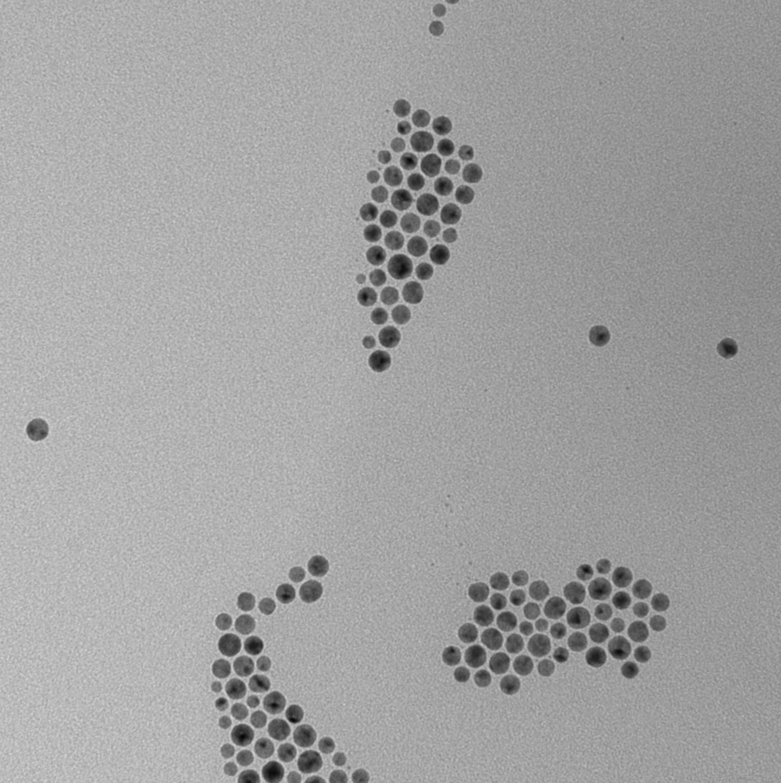
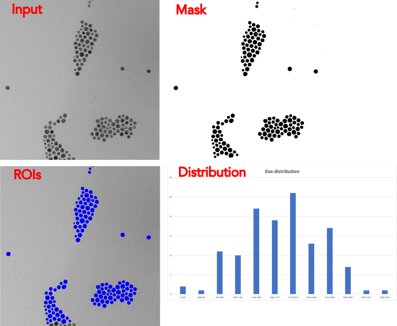

_A region of interest (ROI) represents an area of contiguous pixels within the dimensions of an image._

There are currently two ways ROIs can be generated in ImageJS:

- From [masks](./Working%20with%20Masks.md 'internal link on working with mask') by identifying contiguous black or white pixels within it.
<!-- TODO: add links to the relevant sections once they exist -->
- By identifying starting points of interest (for example by finding and filtering local extrema) and running the watershed algorithm on them.

ROIs identify and characterize regions within images, which has wide applications in image analysis.

```ts
import { fromMask } from 'image-js';

// Get the list of ROIs representing the white regions of the mask
const rois = fromMask(mask).getRois();
```

In general you don't need to worry about the intermediate object returned by `fromMask()`. You will mostly be working with the list of ROIs returned by `getRois()`. It contains all the properties which characterize the region of interest, such as surface, perimeter, fill ratio, etc.

:::tip
In the options parameter,`getRois()` has a `kind` option which tells what kind of regions to return.

| `kind` option | What it does               |
| ------------- | -------------------------- |
| `'bw'`        | returns all the regions    |
| `'black'`     | returns only black regions |
| `'white'`     | returns only white regions |

:::
Let's take a look at a real life example.  
Here you have an image of particles under electron microscopy magnified at 1px = 0.2727 nm. Let's say we want to sort the data by size and observe its distribution. Size distribution analysis is a statistical concept that calculates the frequency of a certain size in a sample.
It can be use in various fields, whether it is for quality control to see if all products have the same features and characteristics or for physical properties of material such as surface area and reactivity.



It can be done with with following code:

```ts
import { Image, fromMask } from 'image-js';

//Convert image to grayscale, then apply a blur on it. This will
// smooth out the noise and avoid creating many small ROIs in the next steps(image 1).
const image = sourceImage.grey().blur({ width: 5, height: 5 });
//Clear border excludes border regions from mask if they don't
//fit completely on an image.
const mask = clearBorder(image.threshold(), { color: 'black' });

//Receive all the regions of interest from mask(colored on image 3).
const roiMap = fromMask(mask);
const rois = roiMap.getRois({ kind: 'black' });

//Distribute regions by size(surface).
//First we find limits and intervals for our size classes.
const maxSurface = Math.max(...rois.map((roi) => roi.surface));
const minSurface = Math.min(...rois.map((roi) => roi.surface));
const span = maxSurface - minSurface;
const interval = Math.round(span / Math.sqrt(rois.length));

const bySizeDistribution = new Map();
//We count number of regions that belong to each interval separately.
for (let i = minSurface; i < maxSurface; i += interval) {
  const count = rois.filter((roi) => {
    return roi.surface >= i && roi.surface < i + interval;
  }).length;
  const intervalString = i + '-' + (i + interval - 1);

  bySizeDistribution.set(intervalString, {
    frequency: count,
    percentage: ((count / rois.length) * 100).toFixed(2),
  });
}
```

This will give us a map with stored number of regions per each size interval. This may be a basic example but such analysis is widely used in biology and medicine. It can provide valuable information about predominant cell size or find abnormalities in cells ratio.



To learn more about our analysis tools you can visit our ROI Analysis section.
