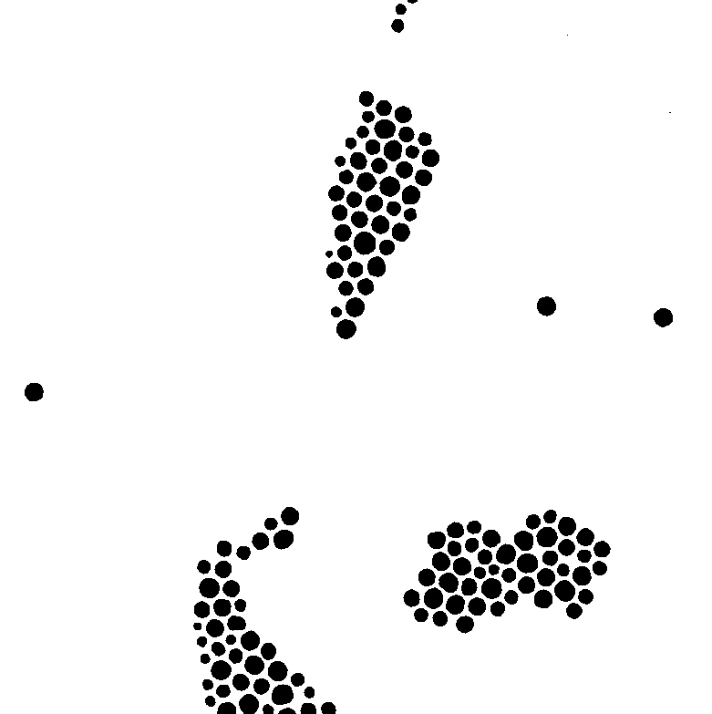
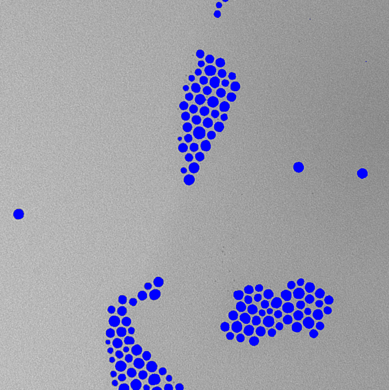
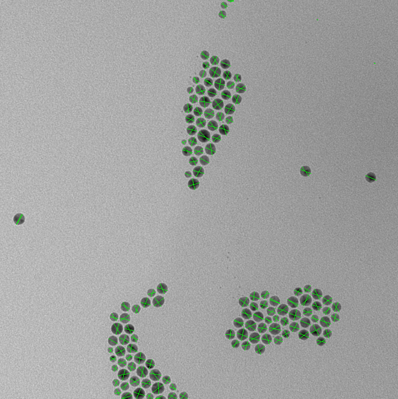
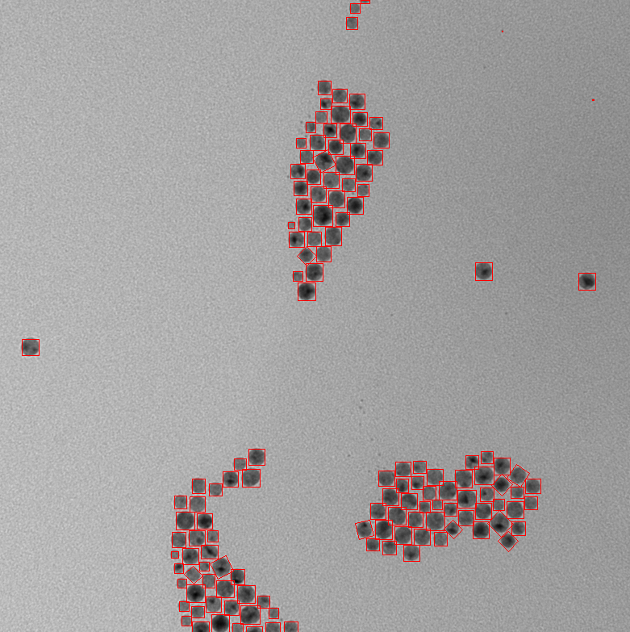

_A region of interest (ROI) represents an area of contiguous pixels within the dimensions of an image._

There are currently two ways ROIs can be generated in ImageJS:

- From [masks](./Working%20with%20Masks.md 'internal link on working with mask') by identifying contiguous black or white pixels within it.
<!-- TODO: add links to the relevant sections once they exist -->
- By identifying starting points of interest (for example by finding and filtering local extrema) and running the watershed algorithm on them.

ROIs identify and characterize regions within images, which has wide applications in image analysis.

```ts
import { fromMask } from 'image-js';

// Get the list of ROIs representing the white regions of the mask
const rois = fromMask(mask).getRois();
```

In general you don't need to worry about the intermediate object returned by `fromMask()`. You will mostly be working with the list of ROIs returned by `getRois()`. It contains all the useful properties which characterize the regions of interest, such as surface, perimeter, centroid etc.

:::tip
In the options parameter,`getRois()` has a `kind` option which tells what kind of regions to return.

| `kind` option | What it does               |
| ------------- | -------------------------- |
| `'bw'`        | returns all the regions    |
| `'black'`     | returns only black regions |
| `'white'`     | returns only white regions |

:::

ImageJS not only works with simple processing but it also specializes in advanced analysis of ROIs on scientific images.  
Here is an example of how to extract ROIs from a real image.

```ts
import { Image, fromMask } from 'image-js';

//image gets grayscaled and blurred for mask extraction(image 1)
const image = sourceImage.grey().blur({ width: 5, height: 5 });
//mask gets extracted(image 2)
const mask = image.threshold();
//receives all the regions of interest(colored on image 3)
const roiMap = fromMask(mask);
const rois = roiMap.getRois({ kind: 'black' });

for (const roi of rois) {
  //gets Feret diameters for each ROI(colored on image 4)
  const feret = roi.feret;
}
```

| **Image 1: input image**                               | **Image 2: image mask**                                     |
| ------------------------------------------------------ | ----------------------------------------------------------- |
|            |            |
| **Image 3: image with regions of interest**            | **Image 4: image with Feret diameters**                     |
|  |  |

Each region of interest possesses many properties and characteristics (ROIs are highlighted in blue).
There are more basic ones like surface and perimeter to know the size. There are also likes of Feret diameter and convex hull as more advanced techniques.


If you need further insight on ROIs level of elongation and shape you can use Feret diameter.
You can use `roi.feret` to get the Feret diameters of region of interest. In our current example, Feret diameters are represented as two green segments.


If you need to localize ROI and have an approximate understanding of its size or placement.
You can use `roi.mbr` to get the Minimum Bounding Rectangle(MBR) of region of interest. In our current example, MBRs are represented on each region as a red rectangle.



Properties shown here only represent a part of what ImageJS analysis is capable of. To learn more about our analysis tools you can visit Analysis section.
