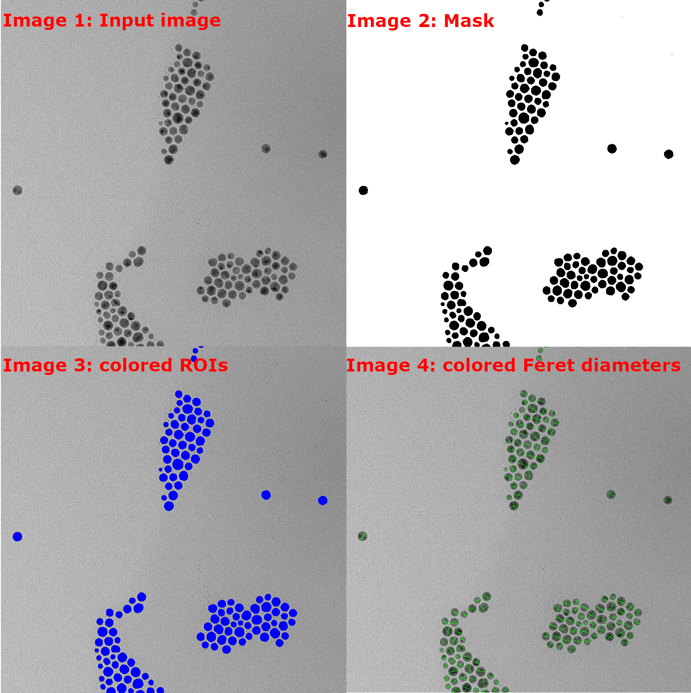

_A region of interest (ROI) represents an area of contiguous pixels within the dimensions of an image._

There are currently two ways ROIs can be generated in ImageJS:

- From [masks](./Working%20with%20Masks.md 'internal link on working with mask') by identifying contiguous black or white pixels within it.
<!-- TODO: add links to the relevant sections once they exist -->
- By identifying starting points of interest (for example by finding and filtering local extrema) and running the watershed algorithm on them.

ROIs identify and characterize regions within images, which has wide applications in image analysis.

```ts
import { fromMask } from 'image-js';

// Get the list of ROIs representing the white regions of the mask
const rois = fromMask(mask).getRois();
```

In general you don't need to worry about the intermediate object returned by `fromMask()`. You will mostly be working with the list of ROIs returned by `getRois()`. It contains all the useful properties which characterize the regions of interest, such as surface, perimeter, centroid etc.

:::tip
In the options parameter,`getRois()` has a `kind` option which tells what kind of regions to return.

| `kind` option | What it does               |
| ------------- | -------------------------- |
| `'bw'`        | returns all the regions    |
| `'black'`     | returns only black regions |
| `'white'`     | returns only white regions |

:::
Let's take a look at a real life example.  
Here you have an image of particles under electron microscopy magnified where 1px = 0.2727 nm. Let's say we want to get the data about all the regions presented on the image and calculate their Feret diameters.


It can be done with with following code:

```ts
import { Image, fromMask } from 'image-js';

//Convert image to grayscale, then apply a blur on it. This will smooth out the noise and avoid creating many small ROIs in the next steps(image 1).
const image = sourceImage.grey().blur({ width: 5, height: 5 });
//Use threshold to convert the grayscale image to a Mask. The default threshold algorithm is Otsu which  will automatically determine the threshold between black and white pixels by minimizing intra-class intensity variance(image 2).
const mask = image.threshold();

//Receive all the regions of interest from mask(colored on image 3).
const roiMap = fromMask(mask);
const rois = roiMap.getRois({ kind: 'black' });

for (const roi of rois) {
  //Get Feret diameters for each ROI(colored on image 4)
  const feret = roi.feret;
}
```

Each region of interest possesses many properties and characteristics (ROIs are highlighted in blue on Image 3).
Feret diameter is a rather advanced property, but there are also more general and basic ones, like surface or perimeter.



If you need a further insight on ROIs level of elongation and shape, however, you can use Feret diameter by calling it with `roi.feret`.
In our current example, they are represented as two green segments(Image 4).

If you need to localize ROI and have an approximate understanding of its size or placement.
You can use `roi.mbr` to get the Minimum Bounding Rectangle(MBR) of region of interest. In our current example, MBRs are represented on each region as a red rectangle.

Properties shown here only represent a part of what ImageJS analysis is capable of. To learn more about our analysis tools you can visit Analysis section.
