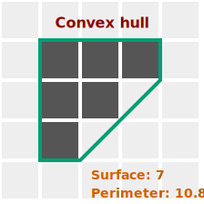

_Smallest convex polygon or polyhedron that contains region of interest._

[Convex Hull](https://en.wikipedia.org/wiki/Convex_hull 'wikipedia link on convex hull') is a way of characterizing the shape of an image by determining which pixels are adjacent to other pixels of the same intensity. This is a good way to find convex features in an image.



:::tip
To understand what convex hull is, picture a rubber band wrapped around your object. The shape of this rubber band will be the shape of your convex hull.
:::

In ImageJS convex hull is a ROI class accessor that returns a `ConvexHull` object.

| Property name                                                                                      | Description                  | Property type |
| -------------------------------------------------------------------------------------------------- | ---------------------------- | ------------- |
| [`points`](https://image-js.github.io/image-js-typescript/interfaces/ConvexHull.html#points)       | points that form convex hull | `Point[]`     |
| [`surface`](https://image-js.github.io/image-js-typescript/interfaces/ConvexHull.html#surface)     | convex hull's surface        | `number`      |
| [`perimeter`](https://image-js.github.io/image-js-typescript/interfaces/ConvexHull.html#perimeter) | convex hull's perimeter      | `number`      |

```ts
const convexHull = roi.convexHull;
```

It can also be a Mask method to calculate its convex hull:

```ts
const convexHull = mask.getConvexHull();
```

<details><summary><b>Implementation</b></summary>

Here's how convex hull algorithm is implemented in ImageJS:

_Calculate border points_: ImageJS uses an algorithm to identify points that constitute regions' borders.

_Sorting points lexicographically_: After finding border points, they get sorted in ascending order.

_Build the lower hull_: Traverse the sorted list of points to build the lower hull of the convex hull. Use a stack to keep track of the points in the lower hull. For each point, check whether it forms a left or right turn with the previous two points in the stack. If it forms a right turn, pop the last point from the stack until a left turn is formed. Then push the current point onto the stack.

_Build the upper hull_: Traverse the sorted list of points in reverse order to build the upper hull of the convex hull. Use the same stack as before. Again, ensure that the points in the stack form a convex hull.

_Combine the lower and upper hulls_: The combined result of the lower and upper hulls is the convex hull of the entire set of points.

</details>
