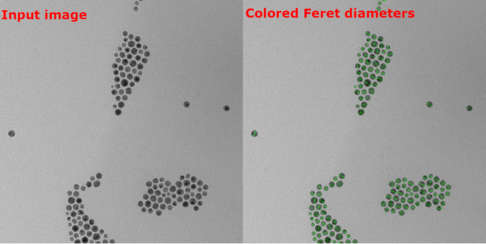

import FeretDemo from './feret.demo.tsx'

_The longest distances between any two points along the boundary of a region in an image._

[Feret diameter](https://en.wikipedia.org/wiki/Feret_diameter 'wikipedia link on feret diameter') is an element of analysis that is determined by measuring the distance between two parallel tangents that are perpendicular to each other and touch the boundary of the object or region of interest.
This measurement is commonly employed in fields such as biology, materials science, and computer vision for the analysis of shapes and structures in images.

:::tip
Feret diameter can be defined by the same lines as if the object was measured by [caliper](https://en.wikipedia.org/wiki/Calipers 'wikipedia link on caliper'). Therefore its other name, caliper diameter.
:::



In ImageJS Feret diameter is a ROI class accessor that returns a Feret object:

It includes:

- minimum diameter

- maximum diameter

- aspect ratio of two diameters

```ts
const feret = roi.feret;
```

It can also be a Mask method:

```ts
const feret = mask.getFeret();
```

:::info
Each diameter in itself is also an object which has its own properties:

- points that form the diameter

- angle

- length

- calliper lines - its the lines that represent the calliper that enfolds an object.

:::

<details><summary><b>Implementation</b></summary>

Here's how Feret diameter is calculated in ImageJS:

_Finding convex hull points_: the fact that searched points belong to convex hull significantly facilitate Feret's diameter's search. Here, a preexisting convex hull method is implemented.(see [convex hull page](./Convex%20Hull.md 'internal link on convex hull') for more information).

_Rotating an object_: an object gets rotated parallel to the X-axis. It allows finding tilt angles of the diameters. After all the data is found, it just gets rotated back by the same angle to get actual result.

_Calculating maximum distance between points_: the algorithm iterates through each point and looks for the biggest distance between other points of convex hull. For the minimum diameter it also compares it with the previous maximum value and if it is smaller, it becomes new current minimum diameter.
For maximum diameter it just calculates the maximum distance between points of convex hull.

_Finding caliper lines_: First, region's extreme values are found among rotated points. For minimum these are X values, for maximum - Y values. After that, lines can be found rather easily. For minimum caliper lines lines have a common Y coordinate with feret points and they are situated at the extremities of an object, which is also easy to obtain, since the object is rotated. Same process for maximum diameter, but this time, it's an X coordinate which is common.

</details>
