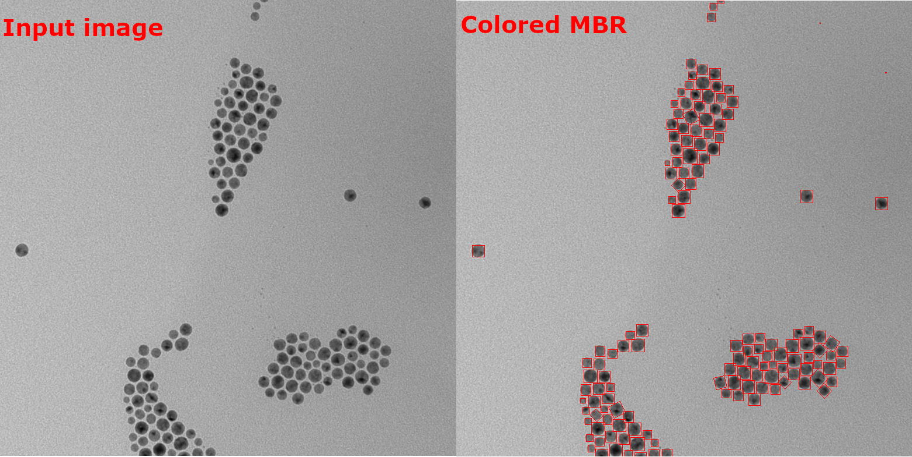

import MbrDemo from './mbr.demo.tsx'

_Smallest axis-aligned rectangle that fully encloses a region of interest, providing a bounding box with minimal area._

Minimum Bounding Rectangle(MBR) is the smallest rectangle which can fit the region of interest in question.
The rectangle is aligned with the coordinate axes (horizontal and vertical), making it simpler to compute and work with in many algorithms.



MBR is relevant for such things as extracting features, detecting collisions or simply localizing objects.

It includes:

- points that form minimum bounding rectangle

- MBR's perimeter

- MBR's surface

- MBR's height

- MBR's width

- MBR's tilt angle

- aspect ratio between width and height

```ts
const mbr = roi.mbr;
```

It can also be a Mask method:

```ts
const mbr = mask.getMbr();
```

<details><summary><b>Implementation</b></summary>

Here's how Minimum Bounding Rectangle is calculated in ImageJS:

</details>
