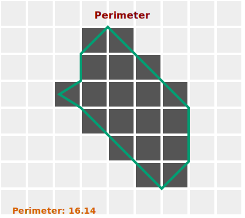

_Total length of the object's outer borders._

Although perimeter might seem like a straight-forward sum of border pixels this is not the case.
In ImageJS each pixel's perimeter gets calculated depending on the number of sides that the pixel is exposed to externally.

This means:

We count all the pixel sides that are outside the ROI (each side counts as 1).  
If a pixel has 1 external side, this pixel's perimeter is equal to **1**.

If a pixel has 2 external sides, we remove from the sum **(2 - √2) = ~0.59**.  
Thus this **pixel's perimeter is equal to 2 - 0.59 = ~1.41**.

If a pixel has 3 external sides, we remove from the sum **2 \* (2 - √2) = ~1.17**.  
So this **pixel's perimeter is equal to 3 - 1.17 = ~1.83**.



Perimeter is basic tool that provides insight to region's size and length.

In ImageJS Perimeter is a ROI accessor that returns a perimeter in pixels:

```ts
const perimeter = roi.perimeter;
```
