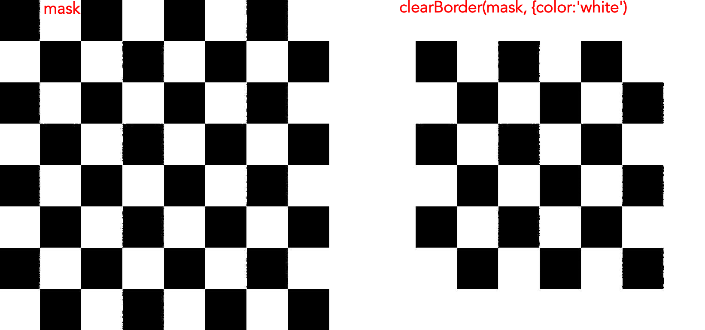

_Removes mask regions at the border of a mask._

[🎭 Mask options and parameters of `clearBorder` method](https://api.image-js.org/classes/index.Mask.html#clearBorder)

`clearBorder()` method removes the elements at the border of the mask. The elements are cleared depending on the color that user specifies as a parameter. This can be used as a preparatory tool for ROI analysis since there are times when regions do not fit completely on an image. With incomplete elements considered as regions the analysis can become misleading.

### Parameters and default values

- `mask`

- `options`

#### Options

| Property                                                                                         | Required | Default value |
| ------------------------------------------------------------------------------------------------ | -------- | ------------- |
| [`allowCorners`](https://api.image-js.org/interfaces/index.ClearBorderOptions.html#allowCorners) | no       | `false`       |
| [`out`](https://api.image-js.org/interfaces/index.ClearBorderOptions.html#out)                   | no       | -             |
| [`color`](https://api.image-js.org/interfaces/index.ClearBorderOptions.html#color)               | no       | `white`       |
