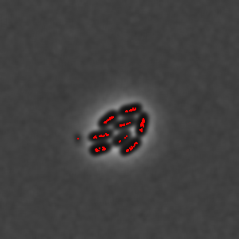
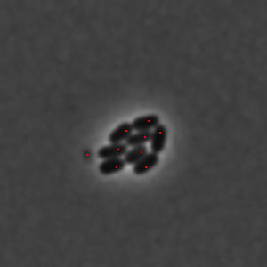

_Filters extrema by value and distance between each other._

`filterPoints` function is another function that has a rather narrow implementation but is important in order to receive better output results from watershed function.

This function reduces extrema by finding euclidean distance between extreme points. If the distance is smaller than the `removeClosePoints` option and points value is bigger than the one it is compared to, the compared point gets removed.

| Extrema without `filterPoints`                                            | Extrema with `filterPoints`                                                 |
| ------------------------------------------------------------------------- | --------------------------------------------------------------------------- |
|  |  |

### Parameters and default values

- `points`

- `image`

- `options`

#### Options

| Property                 | Required | Default value |
| ------------------------ | -------- | ------------- |
| [`removeClosePoints`](#) | no       | `0`           |
| [`kind`](#)              | no       | `'maximum'`   |
| [`channel`](#)           | no       | `0`           |
