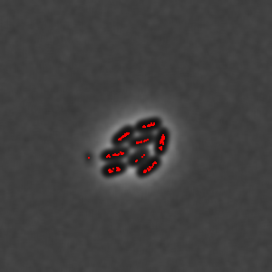
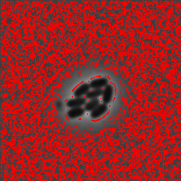

_Finds extreme pixel values in the image._

`getExtrema` might not be the most commonly used function and it does not convert images in any way, but it is indispensable for using `waterShed` properly.
As the name suggests the function finds extreme values of the image. If user looks for minimum values it finds the darkest points, when maximum - the brightest.
The principle is straight-forward: the function iterates through each point and compares values around it. If all the values around point in question is smaller then the point is considered a minimum. Same algorithm for maximum values.

:::tip
You can add a mask as an option to specify locations where to look for extrema.
:::
Without `getExtrema` watershed filter simply cannot find places where to look for objects.

| Minimum                                                            | Maximum                                                            |
| ------------------------------------------------------------------ | ------------------------------------------------------------------ |
|  |  |

### Parameters and default values

- `image`

- `options`

#### Options

| Property         | Required | Default value |
| ---------------- | -------- | ------------- |
| [`kind`](#)      | no       | `'maximum'`   |
| [`mask`](#)      | no       | -             |
| [`algorithm`](#) | no       | `star`        |
| [`maxEquals`](#) | no       | `2`           |
