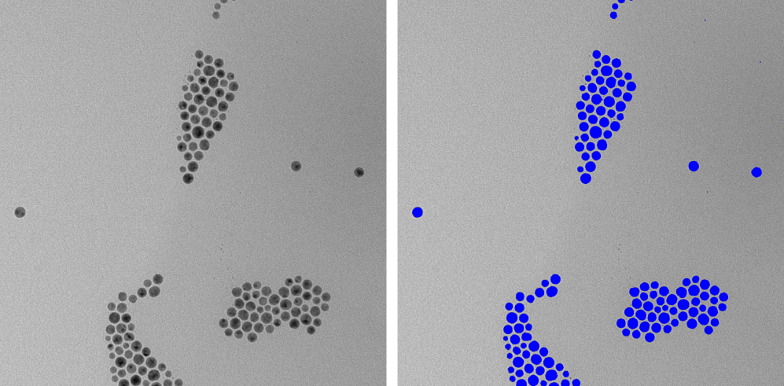

_Paints mask on the image._

[🖼️ Image options and parameters of `paintMask` method](https://image-js.github.io/image-js-typescript/classes/Image.html#paintMask 'github.io link')  
[🎭 Mask options and parameters of `paintMask` method](https://image-js.github.io/image-js-typescript/classes/Mask.html#paintMask 'github.io link')

This method allows painting a mask on the image or on the mask. It can serve as a good visualization tool to highlight the regions in question. For instance, by painting a mask of each black ROI here, we can highlight all the particles present on the image.

```ts
for (const roi of rois) {
  const { column, row } = roi.origin;
  const mask = roi.getMask();
  // This paints blue the mask of a roi.
  //Origin of roi needs to be specified for correct
  //display.
  image = image.paintMask(mask, {
    origin: { column, row },
    color: [0, 0, 255],
  });
}
```



### Kinds of images compatible with algorithm

| Image property | What it means              | Possible values |
| -------------- | -------------------------- | --------------- |
| `bitDepth`     | number of bits per channel | `[8,16]`        |
| `components`   | number of components       | any             |
| `alpha`        | is alpha channel allowed   | `true`          |

### Parameters and default values

- `mask`

- `options`

#### Options

**For image:**

| Property                                                                                                  | Required | Default value      |
| --------------------------------------------------------------------------------------------------------- | -------- | ------------------ |
| [`blend`](https://image-js.github.io/image-js-typescript/interfaces/PaintMaskOnImageOptions.html#blend)   | no       | `true`             |
| [`color`](https://image-js.github.io/image-js-typescript/interfaces/PaintMaskOnImageOptions.html#color)   | no       | 'opaque black'     |
| [`origin`](https://image-js.github.io/image-js-typescript/interfaces/PaintMaskOnImageOptions.html#origin) | no       | `{column:0,row:0}` |
| [`out`](https://image-js.github.io/image-js-typescript/interfaces/PaintMaskOnImageOptions.html#out)       | no       | -                  |

**For mask:**

| Property                                                                                                 | Required | Default value      |
| -------------------------------------------------------------------------------------------------------- | -------- | ------------------ |
| [`value`](https://image-js.github.io/image-js-typescript/interfaces/PaintMaskOnMaskOptions.html#value)   | no       | `1`                |
| [`origin`](https://image-js.github.io/image-js-typescript/interfaces/PaintMaskOnMaskOptions.html#origin) | no       | `{column:0,row:0}` |
| [`out`](https://image-js.github.io/image-js-typescript/interfaces/PaintMaskOnMaskOptions.html#out)       | no       | -                  |
