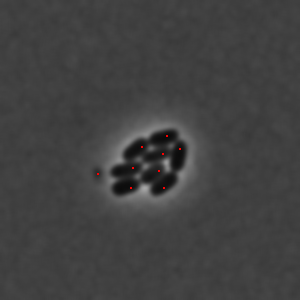

_Filters close points by minimum distance between each other._

`removeClosePoints` function is used for filtering points that are close to each other.

This function sorts an array of points by intensity and then calculates euclidean distance between the points. If the distance between points is smaller than the `removeClosePoints` option the compared point gets removed.

| Extrema without `removeClosePoints`                                    | Extrema with `removeClosePoints`                                            |
| ---------------------------------------------------------------------- | --------------------------------------------------------------------------- |
|  |  |

### Parameters and default values

- `points`

- `image`

- `options`

#### Options

| Property                                                                                                       | Required | Default value |
| -------------------------------------------------------------------------------------------------------------- | -------- | ------------- |
| [`distance`](https://image-js.github.io/image-js-typescript/interfaces/RemoveClosePointsOptions.html#distance) | yes      | -             |
| [`kind`](https://image-js.github.io/image-js-typescript/interfaces/RemoveClosePointsOptions.html#distance)     | yes      | -             |
| [`channel`](https://image-js.github.io/image-js-typescript/interfaces/RemoveClosePointsOptions.html#channel)   | no       | `0`           |
