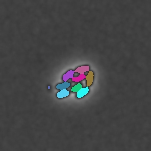

# Watershed

_Separates and identifies distinct regions or objects within an image through gradient information and marker-based segmentation._

[🖼️ Image options and parameters of `waterShed` function](https://image-js.github.io/image-js-typescript/functions/waterShed.html 'github io link')

[Watershed filter](<https://en.wikipedia.org/wiki/Watershed_(image_processing)> 'wikipedia link on watershed') is a way of identifying objects by finding image's extreme points (minima or maxima) in terms of intensity and filling these spaces with color (label). The process reminds geological [watershed](https://en.wikipedia.org/wiki/Drainage_divide 'wikipedia link on drainage divide'), which is the origin of algorithm's name. In order for the "water" not to go overboard and stay within the limits of the region, these limits must be set.

There are two ways to do so. One way is to limit the [intensity](../../Glossary.md#intensity 'glossary link on intensity') by threshold value. Another way is to apply a mask which can set the area where watershed will be implemented.

The watershed algorithm is particularly useful for segmenting objects in images, especially when objects are close to each other.

:::caution
If you look for bright-colored ROIs, then either look for maximum points or invert image before applying watershed.
:::

| Input image with given minima                                              | What watershed finds                                              |
| -------------------------------------------------------------------------- | ----------------------------------------------------------------- |
|  |  |

### Kinds of images compatible with algorithm

| Image property | What it means              | Possible values |
| -------------- | -------------------------- | --------------- |
| `bitDepth`     | number of bits per channel | `[8,16]`        |
| `components`   | number of components       | `[1]`           |
| `alpha`        | is alpha channel allowed   | `false`         |

### Parameters and default values

- `image`

- `options`

#### Options

| Property                                                                                                 | Required | Default value                                                                                    |
| -------------------------------------------------------------------------------------------------------- | -------- | ------------------------------------------------------------------------------------------------ |
| [`mask`](https://image-js.github.io/image-js-typescript/interfaces/WaterShedOptions.html#mask)           | no       | -                                                                                                |
| [`points`](https://image-js.github.io/image-js-typescript/interfaces/WaterShedOptions.html#points)       | no       | minimum points from [`getExtrema()`](./Get%20extrema.md 'internal link on get extrema') function |
| [`threshold`](https://image-js.github.io/image-js-typescript/interfaces/WaterShedOptions.html#threshold) | no       | `1`                                                                                              |
