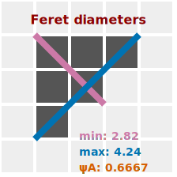

_The longest and shortest distances between two parallel lines that touch a region of interest._

[🎭 Mask options and parameters of `getFeret` method](https://image-js.github.io/image-js-typescript/classes/Mask.html#getFeret 'github.io link')  
[🔎 ROI options and parameters of `feret` accessor](https://image-js.github.io/image-js-typescript/classes/Roi.html#feret 'github.io link')

[Feret diameters](https://en.wikipedia.org/wiki/Feret_diameter 'wikipedia link on feret diameter') are determined by measuring the minimum and the maximum distances between two parallel tangents that touch the boundary of the region of interest.
This measurement is commonly employed for the analysis of shapes and structures in images.

:::tip
Feret diameters can be defined by the points as if the object was measured by [calliper](https://en.wikipedia.org/wiki/Calipers 'wikipedia link on caliper'). Therefore its other name, calliper diameter.
:::



In ImageJS Feret diameters are a ROI class accessor that return a Feret object:

| Property name                                                                                     | Description                    | Property type   |
| ------------------------------------------------------------------------------------------------- | ------------------------------ | --------------- |
| [`minDiameter`](https://image-js.github.io/image-js-typescript/interfaces/Feret.html#minDiameter) | minimum diameter               | `FeretDiameter` |
| [`maxDiameter`](https://image-js.github.io/image-js-typescript/interfaces/Feret.html#maxDiameter) | maximum diameter               | `FeretDiameter` |
| [`aspectRatio`](https://image-js.github.io/image-js-typescript/interfaces/Feret.html#aspectRatio) | ratio between diameter lengths | `number`        |

```ts
const feret = roi.feret;
```

It can also be a Mask method to calculate its feret's diameters:

```ts
const feret = mask.getFeret();
```

:::info
Each diameter in itself is also an object which has its own properties:

| Property name                                                                                                 | Description                                                  | Property type                      |
| ------------------------------------------------------------------------------------------------------------- | ------------------------------------------------------------ | ---------------------------------- |
| [`angle`](https://image-js.github.io/image-js-typescript/interfaces/FeretDiameter.html#angle)                 | Angle between the diameter and a horizontal line in degrees. | `number`                           |
| [`calliperLines`](https://image-js.github.io/image-js-typescript/interfaces/FeretDiameter.html#calliperLines) | Calliper lines that pass by endpoints of Feret diameters.    | `[[Point, Point], [Point, Point]]` |
| [`length`](https://image-js.github.io/image-js-typescript/interfaces/FeretDiameter.html#length)               | length of the diameter                                       | `number`                           |
| [`points`](https://image-js.github.io/image-js-typescript/interfaces/FeretDiameter.html#points)               | start and end points of the diameter                         | `[Point, Point]`                   |

:::

<details><summary><b>Implementation</b></summary>

Here's how Feret diameter is implemented in ImageJS:

_Finding convex hull points_: an algorithm is based on the fact that one of the lines is aligned with one of the convex hull sides. This significantly facilitates Feret's diameter's search. Here, a preexisting convex hull method is implemented.(see [convex hull page](./Convex%20Hull.md 'internal link on convex hull') for more information).

_Rotating an object_: an object gets rotated parallel to the X-axis. It allows finding tilt angles of the diameters. It also simplifies search for points. After all the data is found, it just gets rotated back by the same angle to get actual result.

_Calculating maximum distance between points_: the algorithm iterates through each point and looks for the biggest distance between other points of convex hull. For the minimum diameter it also compares it with the previous maximum value and if it is smaller, it becomes new current minimum diameter.
For maximum diameter it just calculates the maximum distance between points of convex hull.

_Finding caliper lines_: First, region's extreme values are found among rotated points. For minimum these are X values, for maximum - Y values. After that, lines can be found rather easily. For minimum caliper lines lines have a common Y coordinate with feret points and they are situated at the extremities of an object, which is also easy to obtain, since the object is rotated. Same process for maximum diameter, but this time, it's an X coordinate which is common.

</details>
