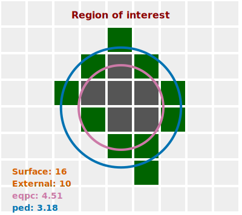

# PED

_Diameter of a circle that has the same perimeter as the region of interest._

[🔎 ROI options and parameters of `ped` accessor](https://api.image-js.org/classes/index.Roi.html#ped)

PED represents a diameter of a circle that has the same perimeter as the particle image.
Similarly to [EQPC](./EQPC.md 'internal link on eqpc') it is used to evaluate ROI's sizes albeit from its perimeter and not surface.



The formula is simple:

$$
PED = \frac{Perimeter}{\pi};
$$

In ImageJS PED is a ROI class accessor that returns a diameter in pixels:

```ts
const pedResult = roi.ped;
```
