In a broader sense of the term, image transformation refers to the process of modifying or converting images from one form to another. This can involve changes to the image's appearance, format, size, or mathematical representation. Therefore converting image's color model from "RGB" format to grayscale can also be considered a transformation.

In ImageJS, however, `transform()` function does transformations that can be accomplished through [matrix multiplication](https://en.wikipedia.org/wiki/Matrix_multiplication).

In this tutorial we will cover and explain basic geometric transformation techniques as well as explain how `transform()` function allows us to modify images.

## How image transformations work

[Geometric transformation](https://www.geeksforgeeks.org/electronics-engineering/geometric-transformation-in-image-processing-1/) modifies the location of pixels in an image. It consists of two main steps:

- Spatial transformation of pixels or coordinates and intensity interpolation.
- Intensity interpolation is used to assign the intensity value of pixels after spatial transformation.

In a geometric transformation a pixel at coordinate $$(x, y)$$ will be moved to coordinate $$(x', y')$$. That is the coordinate (x', y') of the output image which will have the intensity value of the coordinate (x, y) in the input image.

In this tutorial we will focus more on spatial transformation and talk more about interpolation another time. Basic geometric transformation is given by the equation in matrix form:

$$
\begin{bmatrix}
x' \\
y' \\
z'
\end{bmatrix} = A \begin{bmatrix}
x \\
y \\
z\end{bmatrix}
=\begin{bmatrix}
a & b & c\\
d & e & f \\
g & h & i\\
\end{bmatrix}
\begin{bmatrix}
x \\
y \\
z
\end{bmatrix}
$$

where

- $$(x, y,z)$$ is the input coordinate
- $$(x', y',z')$$ is the output coordinate
- $$A$$ is the affine transformation matrix

It is worth mentioning that we will be working with 2D coordinates, so $$z$$ will be 1 in most cases.

## Types of transformation

Here, we distinguish between two primary types of transformations:

### Affine Transformations

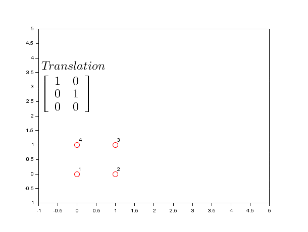;

- **Preserve**: Collinearity and ratios of distances
- **Properties**: Parallel lines remain parallel, straight lines remain straight
- **Use cases**: Scaling, rotation, translation, shearing
- **Matrix size**: 2×3(the bottom row `[0, 0, 1]` is implied)

### Projective Transformations

- **Preserve**: Only collinearity (straight lines remain straight)
- **Properties**: Parallel lines may converge, creates perspective effects
- **Use cases**: Perspective correction, 3D projections, keystone correction
- **Matrix size**: 3×3 (full matrix required)

**The key difference** is that affine transformations might stretch, rotate, or shift a rectangle, but parallel lines remain parallel. Projective transformations can make a rectangle appear tilted or receding into the distance, with parallel lines converging to vanishing points.

## The Transformation Matrix

We use this 3×3 matrix throughout the tutorial:

$$
\begin{bmatrix}
a & b & c\\
d & e & f \\
g & h & i
\end{bmatrix}
$$

Each parameter controls specific aspects of the transformation:

- `a`, `e`: Scaling (horizontal and vertical)
- `b`, `d`: Shearing and rotation
- `c`, `f`: Translation (horizontal and vertical)
- `g`, `h`: Perspective distortion (horizontal and vertical)
- `i`: Normalization factor (usually 1)

For affine transformation 2x3 matrix will be used, because last row is not necessary for this kind of transformation.

## Affine Transformations

### Scaling

Scaling changes the size of your image. Parameters `a` and `e` control horizontal and vertical scaling respectively.

```ts
// Scale image by factor of 2 (Maintaining Aspect Ratio)
const transformationMatrix = [
  [2, 0, 0], // a=2 (horizontal scale), b=0, c=0
  [0, 2, 0], // d=0, e=2 (vertical scale), f=0
];

const scaledImage = image.transform(transformationMatrix);
```

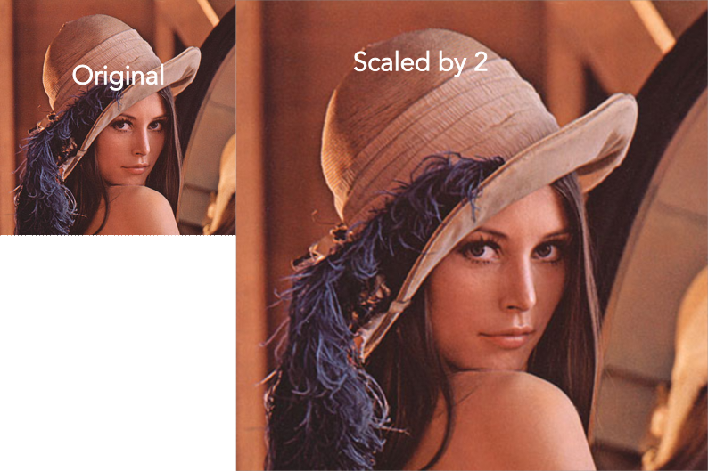

### Non-uniform Scaling

```ts
// Stretch horizontally by 3x, compress vertically by 0.5x
const transformationMatrix = [
  [3, 0, 0], // Horizontal stretch
  [0, 0.5, 0], // Vertical compression
];

const stretchedImage = image.transform(transformationMatrix);
```

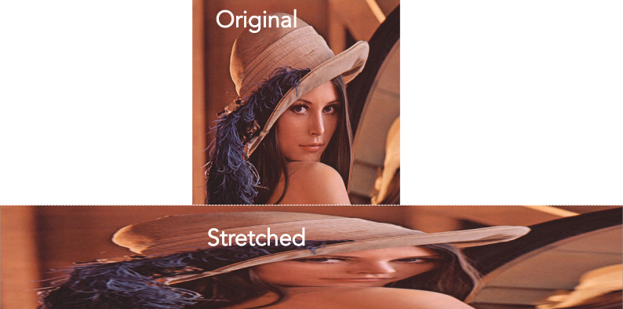

:::note
ImageJS also has [`resize`](../Features/Geometry/Resize.md) function that allows to scale an image.
Current tutorial just demonstrates the basic principle behind transformation of such kind.
:::

#### Common Scaling Examples

```ts
// Shrink to half size
const shrinkMatrix = [
  [0.5, 0, 0],
  [0, 0.5, 0],
];
const shrunkImage = image.transform(shrinkMatrix);
```

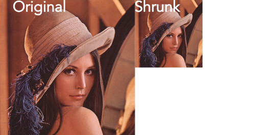

```ts
// Mirror horizontally (flip left-right)
const mirrorMatrix = [
  [-1, 0, 0],
  [0, 1, 0],
];
const mirroredImage = image.transform(mirrorMatrix);
```

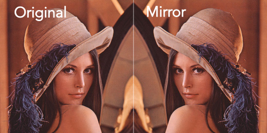

```ts
// Mirror vertically (flip up-down)
const flipMatrix = [
  [1, 0, 0],
  [0, -1, 0],
];
const flippedImage = image.transform(flipMatrix);
```


:::note
ImageJS also has [`flip`](../Features/Geometry/Flip.md) function that allows to flip an image.
Current tutorial just demonstrates the basic principle behind transformation of such kind.
:::

### Translation

Translation moves your image to a different position. Parameters `c` and `f` control horizontal and vertical movement.

```ts
// Move image 50 pixels right and 30 pixels down
const translationMatrix = [
  [1, 0, 50], // c=50 (move right)
  [0, 1, 30], // f=30 (move down)
];

const translatedImage = image.transform(translationMatrix);
```

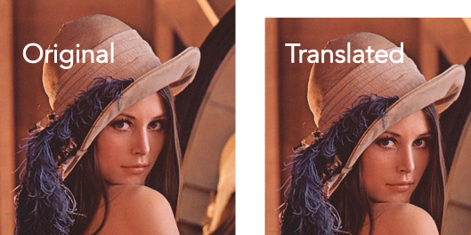

### Rotation

Rotation transforms your image around a point (typically the origin). It uses a combination of parameters `a`, `b`, `d`, and `e`.

For rotation by angle θ (in radians):

- `a` = cos(θ)
- `b` = -sin(θ)
- `d` = sin(θ)
- `e` = cos(θ)

```ts
// Rotate 45 degrees clockwise
const angle = Math.PI / 4; // 45 degrees in radians
const rotationMatrix = [
  [Math.cos(angle), -Math.sin(angle), 0],
  [Math.sin(angle), Math.cos(angle), 0],
];

const rotatedImage = image.transform(rotationMatrix);
```

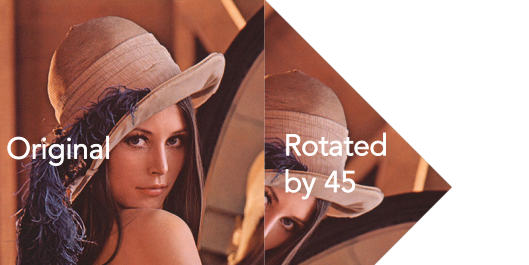

### Shearing

Shearing skews the image, making rectangles appear as parallelograms. Parameters `b` and `d` control shearing.

#### Horizontal shearing

```ts
// Horizontal shear - lean the image to the right
const horizontalShearMatrix = [
  [1, 0.5, 0], // b=0.5 creates horizontal shear
  [0, 1, 0],
];

const horizontalShearImage = image.transform(horizontalShearMatrix);
```

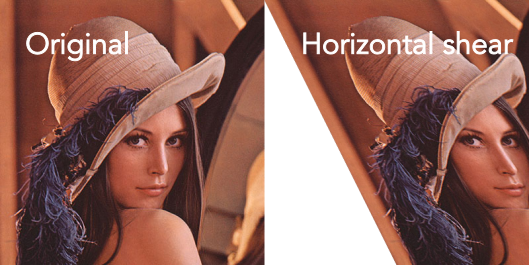

#### Vertical shearing

```ts
// Vertical shear - lean the image upward
const verticalShearMatrix = [
  [1, 0, 0],
  [0.3, 1, 0], // d=0.3 creates vertical shear
];

const verticalShearImage = image.transform(verticalShearMatrix);
```

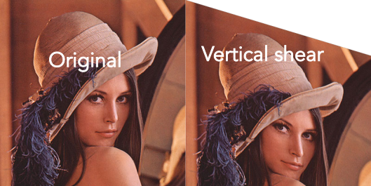

#### Combined shearing

```ts
// Combined shearing
const combinedShearMatrix = [
  [1, 0.5, 0], // Horizontal shear
  [0.3, 1, 0], // Vertical shear
];

const combinedShearImage = image.transform(combinedShearMatrix);
```

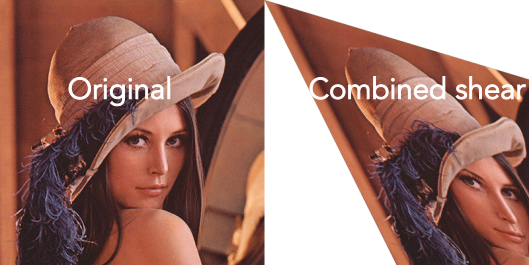

### Complex Affine Transformations

You can combine multiple transformations by multiplying matrices or applying them sequentially:
For example, to rotate around the image center instead of the origin, combine translation with rotation:

```ts
const angle = Math.PI / 4; //45 degrees
const center = image.getCoordinates('center');

const cos = Math.cos(angle);
const sin = Math.sin(angle);

// Translate to origin, rotate, translate back
const matrix = [
  [cos, -sin, center.column * (1 - cos) + center.row * sin],
  [sin, cos, center.row * (1 - cos) - center.column * sin],
];

return image.transform(matrix);
```

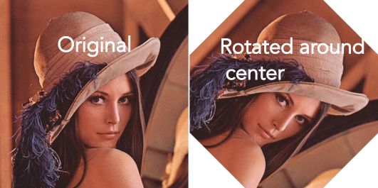

:::note
Image-js also has [`rotate()`](../Features/Geometry/Rotate.md) and [`transformRotate()`](../Features/Geometry/Transform%20and%20Rotate.md) functions. `rotate()` function allows rotating an image by multiple of 90 degrees.
`transformRotate()` allows rotating an image by any degree. It also allows choosing the axe of rotation. So, for rotation, you have other functions that allow you to perform it.
:::

<details>
<summary>
<b> Example of matrix multiplication</b>
</summary>
As mentioned previously, to rotate an image around its center, you need to translate your image to the origin, rotate it, and translate it back to its original position.

Performing these operations separately would require three different matrix multiplications on your image, which is computationally expensive. The optimal solution is to combine all three transformations into a single matrix by multiplying the transformation matrices together first, then applying the result to your image, as was shown in the previous example.

To accomplish this, you can use the [`ml-matrix`](https://mljs.github.io/matrix/index.html 'link on ml-matrix api') package. It facilitates basic matrix operations in ImageJS, as well as more advanced operations like matrix inversion.

Here's a step-by-step code example showing how to create a complex transformation matrix:

```ts
import { Matrix } from 'ml-matrix';

const angle = Math.PI / 4;
const center = image.getCoordinates('center');

const cos = Math.cos(angle);
const sin = Math.sin(angle);
// Step 1: Translate to center.
const translateToOrigin = new Matrix([
  [1, 0, center.column],
  [0, 1, center.row],
  [0, 0, 1],
]);

// Step 2: Rotation matrix
const rotation = new Matrix([
  [cos, -sin, 0],
  [sin, cos, 0],
  [0, 0, 1],
]);

// Step 3: Translate back
const translateBack = new Matrix([
  [1, 0, -center.column],
  [0, 1, -center.row],
  [0, 0, 1],
]);

const rotateAroundCenterMatrix = translateToOrigin
  .mmul(rotation)
  .mmul(translateBack);

const rotateAroundCenterImage = image.transform(
  rotateAroundCenterMatrix.to2DArray(),
);
```

</details>

## Projective Transformations

Projective transformations use the full 3×3 matrix, including the bottom row parameters `g`, `h`, and `i`. These create perspective effects and can map rectangular images onto quadrilaterals.

### Understanding Perspective Parameters

- `g`, `h`: control horizontal and vertical perspective distortions. They allow
- `i`: Normalization factor (typically 1). It simulates what happens in real vision:

1. `i` < 1: Objects appear larger
2. `i` > 1: Objects appear smaller
3. The division by `i` mathematically recreates this effect

The normalization factor is essentially artificial depth - it makes flat 2D coordinates behave as if they exist in 3D space with varying distances from the viewer.
The distortion allows modifying the angle under which you look at the image.

```ts
const perspectiveMatrix = [
  [1, 0, 0],
  [0, 1, 0],
  [0.001, -0.0002, 1],
];
const perspectiveImage = newImage.transform(perspectiveMatrix, {
  //using fullImage:true to show all the pixels.
  fullImage: true,
  // using bicubic interpolation for a more detailed image.
  interpolationType: 'bicubic',
});
```

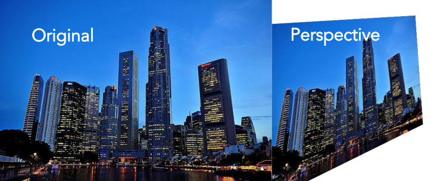

Now, let's take a look at practical uses of such transformation.

### Four-Point Mapping

The most common use of projective transformation is mapping an image to fit within four corner points:

;

```ts
const image = readSync('path/to/file.png');
// Define source corners (original image points) and destination image width and height.
//  In this case they correspond to credit card's corner points.
const sourcePoints = [
  [
    { column: 55, row: 140 },
    { column: 680, row: 38 },
    { column: 840, row: 340 },
    { column: 145, row: 460 },
  ],
  { width: 725, height: 425 },
];

// Get transformation matrix using 4 points and `getPerspectiveWarp` function.
const projectionMatrix = getPerspectiveWarp(sourcePoints);
const projectedImage = image.transform(projectionMatrix.matrix, {
  width: projectionMatrix.width,
  height: projectionMatrix.height,
  inverse: true,
});
```

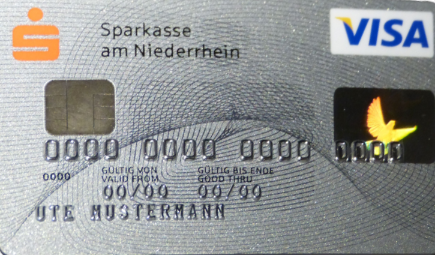;

:::note
For calculating perspective warp matrix, width and height can be omitted as options.
In that case, they will be calculated from source points.
:::

### Keystone Correction

Let's take this image again as an example.

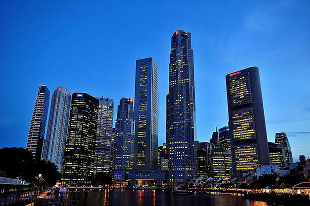

A common problem when taking photos of tall buildings is that they can look as if they're leaning backwards. This is known as the "[keystone effect](https://en.wikipedia.org/wiki/Keystone_effect)" (or the "tombstone effect"), and it can be a very distracting form of distortion in your images.

```ts
// Correcting keystone effect - make trapezoid into rectangle. These points work for an image with
//buildings. For more automatic approach you need to use something more advanced.
const keystoneMatrix = getPerspectiveWarp([
  { column: 60, row: 0 },
  { column: newImage.width - 59, row: 0 },
  { column: newImage.width - 1, row: newImage.height - 1 },
  { column: 0, row: newImage.height - 1 },
]);

const correctedImage = newImage.transform(keystoneMatrix.matrix, {
  inverse: true,
  width: newImage.width,
  height: newImage.height,
  // Using bicubic interpolation for better image quality.
  interpolationType: 'bicubic',
});

const correctedImage = image.transform(keystoneMatrix);
```

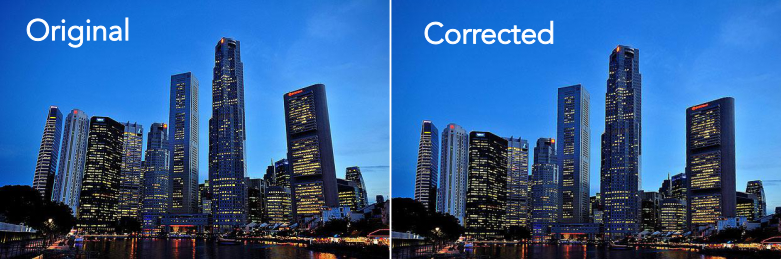
