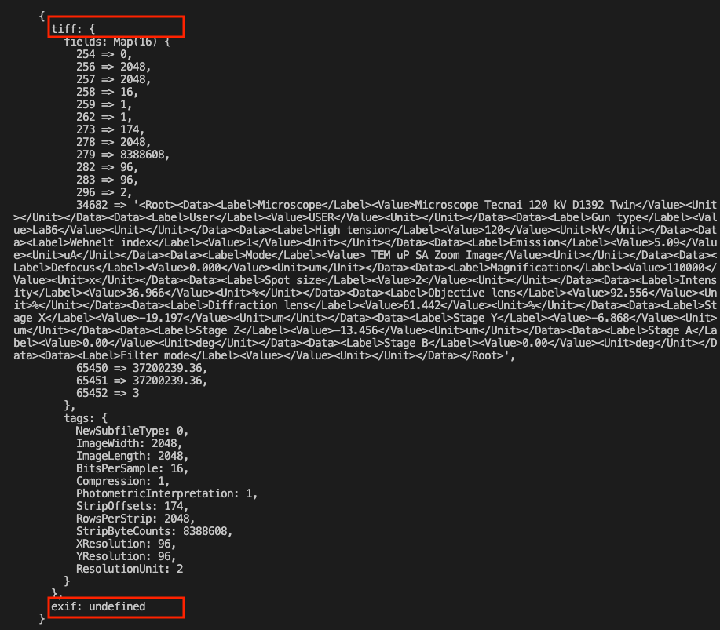
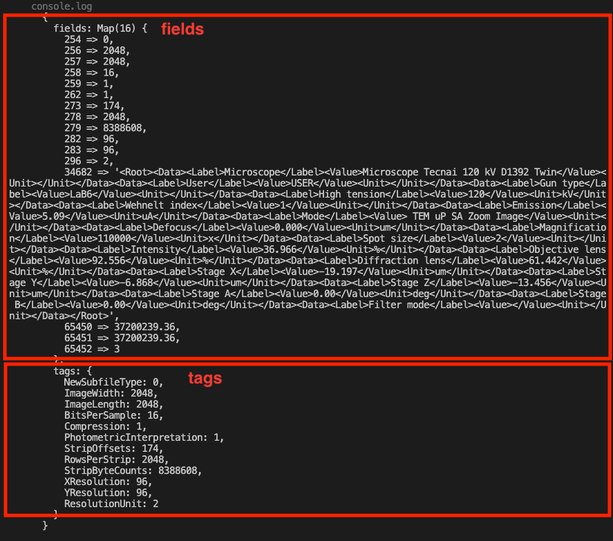
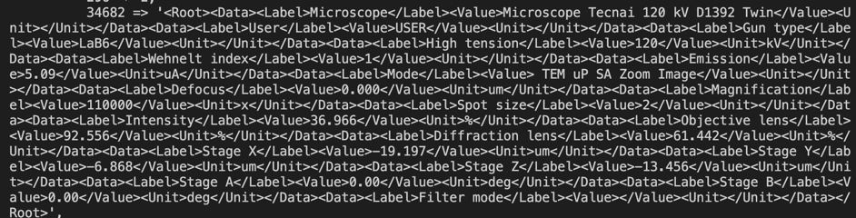
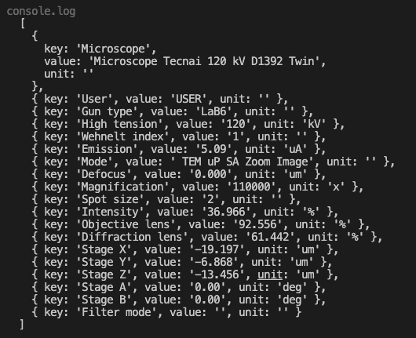
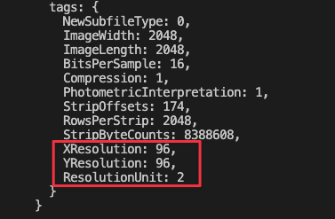
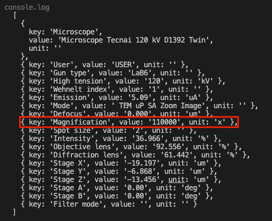

In this tutorial we will discuss metadata extraction with an image that we already familiar with: the image of particles. We will also talk about pixel size and the way it is calculated.


[Metadata](../Glossary.md#metadata 'glossary link on metadata') represents information about various aspects of an image itself. It can be something basic such as the date when an image was taken, or something more specific like the name of the camera that the image was taken by. You can extract metadata tags that can provide additional information about an image by using this command:

```ts
const meta = image.meta;
```

## Getting metadata from TIFF files



In ImageJS there are two supported formats for metadata: `exif` and `tiff`. While `exif` is a format used by digital images of other formats to store metadata, `tiff` is an image format used for high quality [raster graphics](https://en.wikipedia.org/wiki/Raster_graphics 'wikipedia link for raster graphics') images. Since our image in question is of `tiff` format we will focus on `tiff` part.

```ts
const meta = image.meta.tiff;
```

There you will have two other subparts: one part will be comprised of a map with fields and then an object of TIFF meta tags which these fields' values are attributed to.



### Getting extra data

You might be wondering what this huge mix of letters and numbers represents:



Well, the TIFF format has a feature of adding custom [XML](https://en.wikipedia.org/wiki/XML 'wikipedia link on xml') metadata fields and this is the way they are stored. For instance, in this case you can get information about the microscope that was used, or the magnification level that was used while the image was taken. However, this data needs to be parsed, as it is difficult to decipher in its raw format.
To do so you need to identify what is the key id of this text. In our case it is `34682`, but it might not always be the case so check it beforehand.

Next thing we need to do is to parse this text.

```ts
let metaMisc = [];

let lines = image.meta.tiff.fields.get(34682).split('</Data><Data>');
//We split each line into three elements:
//key(name of the tag)
//value(value of the tag)
//unit(units in which the value is measured).
lines.forEach((a) => {
  var fields = a.split(/<\/Label><Value>|<\/Value><Unit>/);
  fields[0] = fields[0].replace(/^.*>/, '');
  fields[2] = fields[2].replace(/<.*$/, '');
  metaMisc.push({
    key: fields[0],
    value: fields[1],
    unit: fields[2],
  });
});
```

With this the data in the console should look like this.



### Getting pixel size

In this specific scenario we would also like to tell you about the way to calculate image's pixel size. It is an important aspect to deduce image's detail sharpness and display's quality.
Pixel size can be one of metadata fields but if this isn't the case you might be able to calculate it from the existing data.

In this specific scenario to calculate pixel size you can calculate DPI resolution and apply it with magnification.
DPI resolution represents the number of dots per inch. To calculate it we need to look at three lines in our parsed extra data: `XResolution`, `YResolution` and `ResolutionUnit`.
X and Y resolutions are the number of dots per inch on X and Y axes. So, if they are equal, then DPI resolution equals to one of these values. However, this value might not be measured in inches. To check that we need to look at the value of `ResolutionUnit`.
If its value equals to 2 then the X and Y resolutions are measured in inches. If it's 3 then it's in centimeters and has to be converted.

:::info
`ResolutionUnit` can also be equal to 1. This means that the image doesn't have an absolute unit of measurement. Used for images that may have a non-square aspect ratio, but no meaningful absolute dimensions.
:::



```ts
const DPIResolution = 0;
const metaTags = image.meta.tiff.tags;
if (metaTags.XResolution == metaTags.YResolution && metaTags.XResolution) {
  switch(metaTags.ResolutionUnit)
    case 2:
      DPIResolution = metaTags.XResolution;
      break;
    case 3:
      //converted from inches to centimeters
      DPIResolution = metaTags.XResolution/2.54;
      break;
    default:
      break;
}
```

After that we need to get the magnification. In our case it is already known.



All is left is to calculate it through the formula.

```ts
const newPixelSize = 30000 / magnification[0].value / 1e9;
//It is equal 2.7272727272727273e-10 meters.
//We already have an object that stores extra data, so let's add pixel size there.
metaMisc.push({ key: 'Pixel Size', value: newPixelSize, unit: 'm' });
```
