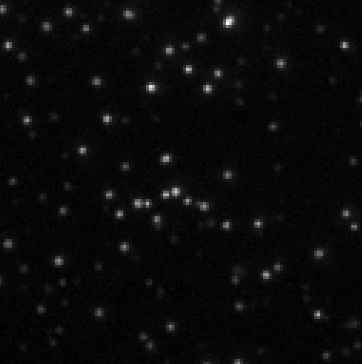
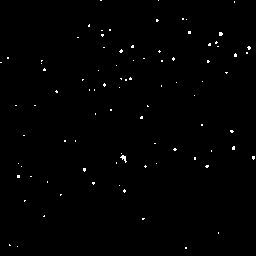

The point of this tutorial is to show how to decode a stack of images and how to do some basic analysis with it.

## Synopsis

This tutorial demonstrates how to use ImageJS to decode a TIFF stack of images and analyze frame-by-frame changes, particularly focusing on regions of interest (ROIs) in pulsar images. The process involves:
Using the fs library we read and decode the TIFF stack.
Then,utilizing the `maxImage()` function to get the image with the maximum pixel values across the stack.
We identify regions of interest from the maximum value image using a threshold mask and obtaining their coordinates.
Finally we compute the average pixel value for each ROI across all images in the stack, storing the results in a map.
We can use this data to analyze changes in intensity over time.

```ts
const buffer = fs.readFileSync('/path/to/file.tiff');
const stack = decodeStack(stack);
const maxValueImage = stack.maxImage();
const maxValueMask = maxValueImage.threshold();
const roiMap = fromMask(maxValueMask);
//Provides all the regions of interest.
const rois = roiMap.getRois();
const stackGrays = new Map<number, number[]>();
for (const roi of rois) {
  const stackAvgs = [];
  const roiPoints = roi.absolutePoints;
  for (const image of stack) {
    const avgValue = image.mean({ points: roiPoints });
    //Gets value from one channel since it is grayscaled.
    stackAvgs.push(avgValue[0]);
  }
  stackGrays.set(roi.id, stackAvgs);
}
```

## Decode the Stack

ImageJS has the ability to decode a `tiff` stack of images. Images in stack can represent frame-by-frame successive changes. This way we can take a look dynamically at changes that happen to regions of interest.
In our specific case here, we have a stack of pulsar kind of images. We can use ImageJS to figure out when the region is shown in the image and when it isn't by looking at the average value of said region.

Just like any image, after getting our stack needs to be parsed fo us to work with data. ImageJS doesn't have a built-in function to parse tiff stack, so you will have to use
`fs` library.

```ts
const buffer = fs.readFileSync('/path/to/file.tiff');
const stack = decodeStack(stack);
```

## Find the image with maximum values:

Stack class has a function called `maxImage()`. It will give us the maximum value of each pixel throughout the stack. We will use this image as a reference for all other images, to locate all possible regions of interest.

```ts
const maxValueImage = stack.maxImage();
```

;

## Locate ROIs

From our "maxValues" image we can find all the regions of interest. To be precise we need their coordinates to apply them to other images.

```ts
const maxValueMask = maxValueImage.threshold();
const roiMap = fromMask(maxValueMask);
//Provides all the regions of interest.
const rois = roiMap.getRois();
```

;

## Find average value of each ROI on each image

After we found all the ROIs on the "maxValue" image, we take each region and check its average value on every image in the stack.
It will look something like this:

```ts
const stackGrays = new Map<number, number[]>();
for (const roi of rois) {
  const stackAvgs = [];
  const roiPoints = roi.absolutePoints;
  for (const image of stack) {
    const avgValue = image.mean({ points: roiPoints });
    //Gets value from one channel since it is grayscaled.
    stackAvgs.push(avgValue[0]);
  }
  stackGrays.set(roi.id, stackAvgs);
}
```

This will create a map where the key is the ID of each ROI, and the values are an array of average values of ROI coordinates across all the images in the stack.
This way we can take a look at the changes in intensity of ROI from one image to another.
This will give us the graph of intensities across all the images in the stack for each ROI.

### Add graph image
