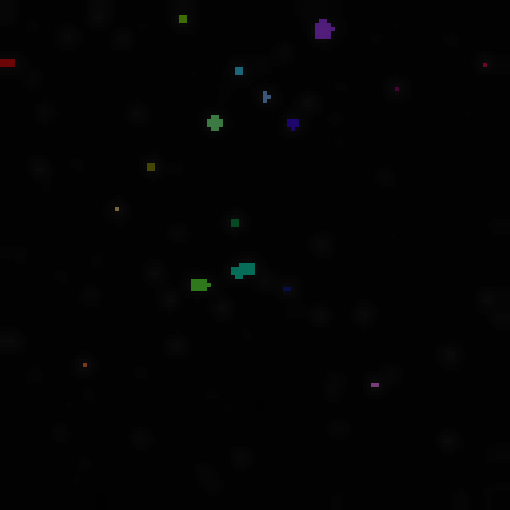
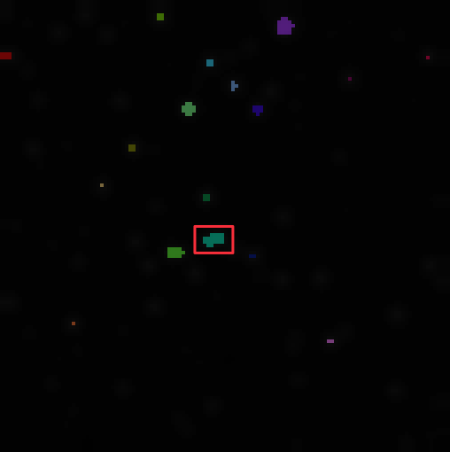
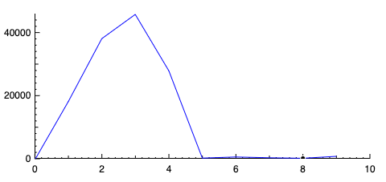

The point of this tutorial is to show how to decode a stack of images and how to do some basic analysis with it.

## Synopsis

This tutorial demonstrates how to use ImageJS to decode a TIFF stack of images and analyze frame-by-frame changes, particularly focusing on regions of interest (ROIs) in pulsar images.

- Using the `fs` library we read and decode the TIFF stack.
- Then, utilizing the `maxImage()` function, we get the image with the maximum pixel values across the stack. Since we need to use `threshold()`to find ROI, we must check if its `colorModel` is `"GREY"`. If not, image must be grayscaled.
- We identify regions of interest from the maximum value image using a `threshold()` algorithm and applying `fromMask()`and `getRois()` functions. We obtain their coordinates.
- Finally we compute the average pixel value for each ROI across all images in the stack, storing the results in a map.
  We can use this data to analyze changes in intensity over time or compare changes in its position.

```ts
const buffer = fs.readFileSync('/path/to/file.tiff');
const stack = decodeStack(buffer);

let maxValueImage = stack.maxImage();
//We will use `threshold()` to find ROIs
//therefore color model has to be "GREY".
if (maxValueImage.colorModel !== 'GREY') {
  maxValueImage = maxValueImage.grey();
}
const maxValueMask = maxValueImage.threshold();
const roiMap = fromMask(maxValueMask);
//Provides all the regions of interest.
const rois = roiMap.getRois();
const stackGrays = new Map<number, number[][]>();
for (const roi of rois) {
  const stackAvgs = [];
  const roiPoints = roi.absolutePoints;
  for (const image of stack) {
    const avgValue = image.mean({ points: roiPoints });
    stackAvgs.push(avgValue);
  }
  stackGrays.set(roi.id, stackAvgs);
}
```

Here is a more detailed review of these steps.

## Decode the Stack

ImageJS has the ability to decode a TIFF stack of images. A TIFF stack is a TIFF file that contains multiple images. In our specific case here, we have a stack of pulsar kind of images. They represent frame-by-frame successive changes. This way we can take a look at dynamic changes that happen to regions of interest.
We can use ImageJS to figure out when the region is visible and when it isn't by looking at the average value of said region.

Just like any image, after getting our stack needs to be parsed fo us to work with data.

```ts
//ImageJS doesn't have a built-in function to parse TIFF stack,
//so use `fs` library.
const buffer = fs.readFileSync('/path/to/file.tiff');
const stack = decodeStack(buffer);
```

## Find the image with maximum values:

Stack class has a function called `maxImage()`. It will give us the maximum value of each pixel throughout the stack. We will use this image as a reference for all other images to locate their ROIs.

```ts
const maxValueImage = stack.maxImage();
//We will use `threshold()` to find ROIs
//therefore color model has to be "GREY".
if (maxValueImage.colorModel !== 'GREY') {
  maxValueImage = maxValueImage.grey();
}
```

;

## Locate ROIs

From our `maxValueImage` we can find all regions of interest. To be precise we need their coordinates to apply them to other images.

```ts
const maxValueMask = maxValueImage.threshold();
const roiMap = fromMask(maxValueMask);
```


```ts
//Provides all the regions of interest.
const rois = roiMap.getRois();
```



## Find average value of each ROI on each image

After we found all the ROIs on the `maxValueImage`, we take each region and check its average intensity on every image in the stack.
It will look something like this:

```ts
const stackGrays = new Map<number, number[][]>();
for (const roi of rois) {
  const stackAvgs = [];
  const roiPoints = roi.absolutePoints;
  for (const image of stack) {
    const avgValue = image.mean({ points: roiPoints });
    //Gets value from one channel since it is grayscaled.
    stackAvgs.push(avgValue);
  }
  stackGrays.set(roi.id, stackAvgs);
}
```

This will create a map where each key is an ROI ID, and each value is an array of average pixel intensities across the image stack.
This way we can take a look at the changes in intensity of ROI from one image to another.
For instance here we have a graph of intensity of region with ID equal to 9.
We can see that there is a rising pulse between images 1 and 4, but then it disappears.



