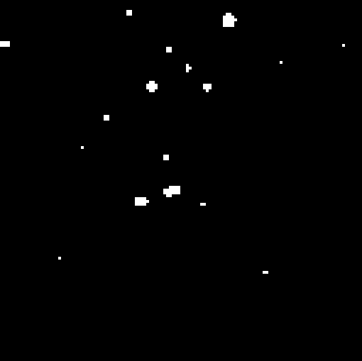

The point of this tutorial is to show how to decode a stack of images and how to do some basic analysis with it.

## Synopsis

This tutorial demonstrates how to use ImageJS to decode a TIFF stack of images with similar properties and analyze frame-by-frame changes, particularly focusing on regions of interest (ROIs) and their changes in pulsar images.

- We read and decode the TIFF stack.
- Then, we get the image with the maximum pixel values across the stack.
- We identify regions of interest from the maximum value image. First we segment an image using a global threshold algorithm ([`otsu`](https://en.wikipedia.org/wiki/Otsu%27s_method 'wikipedia link on otsu thresholding') algorithm by default). From obtained binary image we get coordinates of ROIs.
- Finally we compute the average pixel value for each ROI across all the images of the stack.

We can use this data to analyze changes in intensity over time in each region of interest.

```ts
import { readFileSync } from 'node:fs';

const buffer = readFileSync('./path/to/file.tiff');
const stack = decodeStack(buffer);

let maxValueImage = stack.maxImage();
// Convert to grey image to prepare for thresholding
if (maxValueImage.colorModel !== 'GREY') {
  maxValueImage = maxValueImage.grey();
}
const maxValueMask = maxValueImage.threshold();
const roiMap = fromMask(maxValueMask);
// Detect objects (regions of interest) in the image
const rois = roiMap.getRois();
const stackGrays = new Map<number, number[][]>();
for (const roi of rois) {
  const stackAvgs = [];
  const roiPoints = roi.absolutePoints;
  for (const image of stack) {
    const avgValue = image.mean({ points: roiPoints });
    stackAvgs.push(avgValue);
  }
  stackGrays.set(roi.id, stackAvgs);
}
```

Here is a more detailed review of these steps.

## Introduction

ImageJS has the ability to decode a TIFF stack of images. A TIFF stack is a TIFF file that contains multiple images. In our specific case here, we have a stack of pulsar kind of images. They represent dynamic changes that happen to regions of interest frame-by-frame.
We can use ImageJS to figure out when the region is visible and when it isn't by looking at the average value of said region compared to its maximum value across the stack.

Let's go step by step together to figure out how it works.

## Decode the Stack

Just like any image, our stack needs to be decoded for us to work with data.

```ts
import { readFileSync } from 'node:fs';

const buffer = readFileSync('/path/to/file.tiff');
const stack = decodeStack(buffer);
```

:::warning
`Stack` class works only with images that share same properties. Particularly, values for [bit depth](../Glossary.md#bit-depth 'internal link on bit depth'), [color model](../Glossary.md#color-model 'internal link on color model'), width and height must be the same.
:::

## Find the image with maximum values:

Stack class has a function called `maxImage()`. It will give us the maximum value of each pixel throughout the stack. In our particular example we use `maxImage()`. The reason for it is that we want to look at the evaluation of pulsing particles. Therefore we need to detect all the appeared particles throughout the stack. We will use this image as a reference for all other images to locate their ROIs.

```ts
const maxValueImage = stack.maxImage();
```


## Locate ROIs

From our `maxValueImage` we can find all regions of interest. To be precise we need their coordinates to apply them to other images.

```ts
// Convert to grey image to prepare for thresholding
if (maxValueImage.colorModel !== 'GREY') {
  maxValueImage = maxValueImage.grey();
}
const maxValueMask = maxValueImage.threshold();
const roiMap = fromMask(maxValueMask);
```



```ts
// Detect objects (regions of interest) in the image
const rois = roiMap.getRois();
```


## Find average value of each ROI on each image

After we found all the ROIs on the `maxValueImage`, we take each region and check its average intensity on every image in the stack.
It will look something like this:

```ts
const stackGrays = new Map<number, number[][]>();
for (const roi of rois) {
  const stackAvgs = [];
  const roiPoints = roi.absolutePoints;
  for (const image of stack) {
    const avgValue = image.mean({ points: roiPoints });
    //Gets value from one channel since it is grayscaled.
    stackAvgs.push(avgValue);
  }
  stackGrays.set(roi.id, stackAvgs);
}
```

For each detected ROI, we compute the average value of the pixels in the ROI for each image in the stack.
This gives us a time serie of intensities, which gives us an insight about when in time the detected objects appeared.
This way we can take a look at the changes in intensity of ROI from one image to another.
For instance here we have a graph of intensity of region with ID equal to 9.
We can see that there is a rising pulse between images 1 and 4, but then it disappears.


