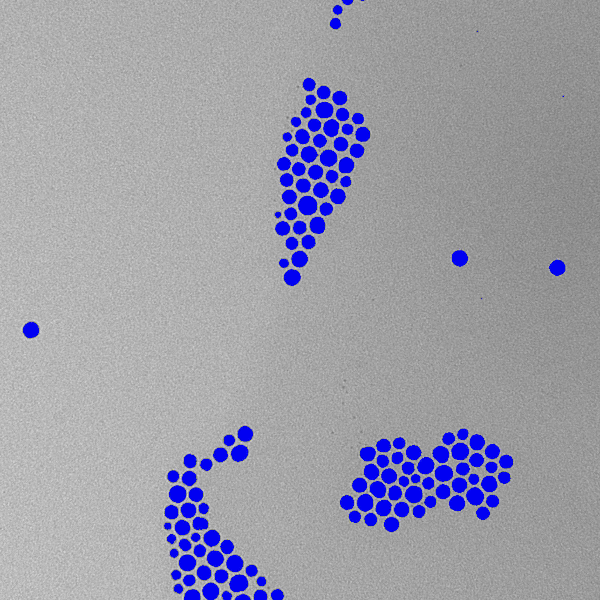

In this tutorial we are going to cover the threshold operation and how to get a map of regions from the threshold's mask.

### What is threshold and where it is used

One of the features in ImageJS is the ability to extract and analyze specific regions of the image.
However, to get these regions you need to localize them first. This is where thresholding comes in.

Thresholding is an [image segmentation](../Glossary.md#image-segmentation) technique. It separates image's foreground objects from their background based on pixel intensity value.
For instance here is the image of particles under electronic microscopy.


Each object is well-defined and separated from each other, so in this case threshold algorithm will fit perfectly.

### Choosing an algorithm

:::info
If an image's color model is not `grey` then it first needs to be [grayscaled](../Features/Filters/Grayscale.md 'internal link on grayscale'). Threshold algorithm works only if an image has one channel.

```ts
image = image.grey();
```

:::

There are two ways of using threshold: by calling an algorithm name or by directly using a threshold value.

The default algorithm is [`otsu`](https://en.wikipedia.org/wiki/Otsu%27s_method 'wikipedia link on otsu'). It is a popular technique that uses weighted variance between foreground and background. It iterates through all the possible threshold values and finds the value where the spread between foreground and background is the lowest. After that it separates each pixel according to

In ImageJS threshold possesses multiple threshold algorithms.

:::tip
If you want to use threshold by a threshold value of one of the algorithms, you can use `computeThreshold` function:

```ts
const value = computeThreshold(image, 'otsu');
// computeThreshold computes the intensity value, but threshold function accepts it
//as a ratio between 0 and 1. So a division on maximum value is necessary.
const mask = image.threshold({ threshold: value / image.maxValue });
```

The output result will be identical to a result with a threshold algorithm as a parameter.  
:::


As you can see, `otsu` algorithm defines the regions well.
However, an output of each algorithm will vary from one image to another. So we strongly recommend to try several algorithms to see which one fits your needs.

By using threshold method you convert an image into a `Mask` class object which is a binary image:

```ts
// Algorithm is otsu by default but
// we added the parameter here explicitly to show how the parameter is used.
const mask = image.threshold({ algorithm: 'otsu' });
```

:::info
`threshold()` also has an `out` option which allows you to specify which image to use as an output. To learn more about this option and its purposes visit our article about an [`out` parameter](../Useful%20tips/Out-parameter%20and%20its%20purpose.md).
:::

### Finding ROI map

With threshold you create a mask, which allows us to separate objects from their background. All is left is to locate and store those objects by creating a `RoiMap` object. `RoiMap` is an object that stores all the data about regions of interest situated on the image.
To get this map all you need is to apply `fromMask()` function:

```ts
import fromMask from 'image-js';

const roiMap = fromMask(mask);
```

In the end you should be able to get a map of all the regions of interest(black ROIs are colored here):


:::info
It is worth mentioning an `allowCorners` option of `fromMask` function. You can specify if regions connected by corners should be considered as two separate regions or as one whole region.
This option is set to `false` by default.
:::
