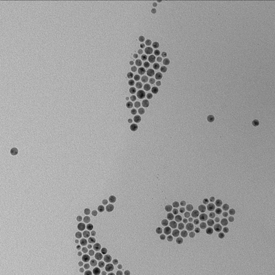
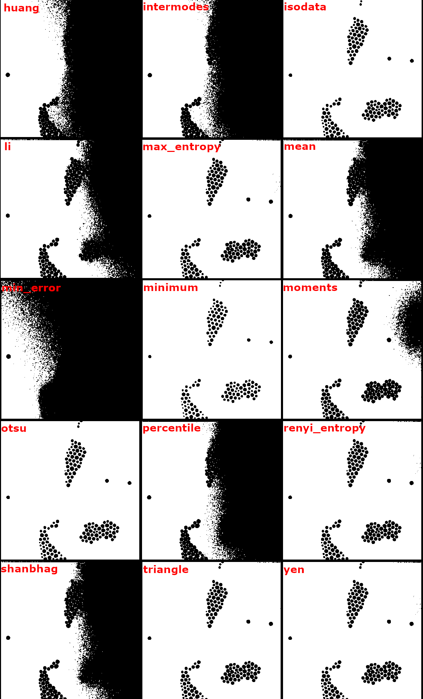
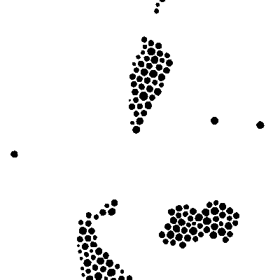
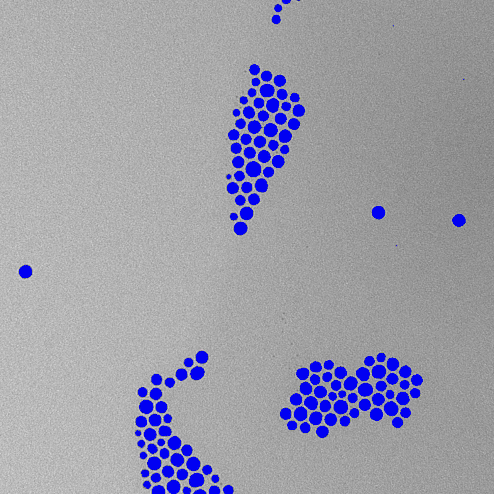
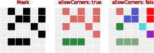

In this tutorial we are going to cover the threshold operation and how to get a map of regions from the threshold's mask.

## Synopsis

Here is a quick summary of this tutorial.

Threshold is used for [image segmentation](../Glossary.md#image-segmentation) to locate specific regions of interest(ROI) by separating background and foreground of the image. By doing so, we can create a map of regions, a `RoiMapManager` object.
:::tip
Before proceeding with threshold application it is recommended to blur the image. Do not overdo it. With a kernel too big, regions' borders start to deteriorate.
:::
An image must be gray. If this isn't the case, it must be grayscaled. After that, you need to choose the way for threshold to be found. It can be an arbitrary value, but we recommend to use one of the algorithms that ImageJS has. It is important to remember that different algorithms serve different purposes, so it is better to try several of them to see which one fits better for the current image.
Once threshold is applied, you will get a mask, which will allow you to localize and extract specific objects or regions of interest situated on the image.
So it will look something like this:

```ts
if (image.colorModel !== 'GREY') {
  image = image.grey();
}
const mask = image
  .blur({ width: 3, height: 3 })
  .threshold({ algorithm: 'otsu' });
const roiMapManager = fromMask(mask);
```

## What is threshold and where it is used

One of the ImageJS features is the ability to extract and analyze specific regions of the image(regions of interest or ROI).
However, to get these regions you need to localize them first. This is where thresholding comes in.

Thresholding is an [image segmentation](../Glossary.md#image-segmentation) technique. It separates image's foreground objects from their background based on pixel intensity value. It works especially well when background is rather simple and well-defined.
For instance here is an image of particles under electronic microscopy.



Each object is well-defined and separated from each other, while the background is basically a gray-colored canvas. In this case threshold algorithm will fit perfectly.

## Choosing an algorithm

:::info
If an image's color model is not `grey` then it first needs to be [grayscaled](../Features/Filters/Grayscale.md 'internal link on grayscale'). Threshold algorithm works only if an image has one channel.

```ts
image = image.grey();
```

:::

The default algorithm is [`otsu`](https://en.wikipedia.org/wiki/Otsu%27s_method 'wikipedia link on otsu'). It is a popular technique that uses weighted variance between two classes of pixels. In ImageJS we use [cumulative distribution function](https://en.wikipedia.org/wiki/Cumulative_distribution_function 'wikipedia link to cumulative distribution function') to compute cumulative probability of encountering pixel intensities up to a certain level. This allows calculating between-class variance between the two created classes and find an optimal threshold value. After that it checks each pixel whether its intensity value is smaller or bigger than the calculated threshold.

:::tip
There are two ways of using threshold: by calling an algorithm name or by directly using a threshold value.
If you want to use threshold by a threshold value of one of the algorithms, you can use `computeThreshold` function:

```ts
const value = computeThreshold(image, 'otsu');
// computeThreshold computes the intensity value, but threshold function accepts it
//as a ratio between 0 and 1. So a division on maximum value is necessary.
const mask = image.threshold({ threshold: value / image.maxValue });
```

The output result will be identical to a result with a threshold algorithm as a parameter.  
:::



As you can see, `otsu` algorithm defines regions quite well.
However, an output of each algorithm will vary from one image to another. ImageJS possesses multiple threshold algorithms.
So we strongly recommend to try several variants to see which one fits your needs better.

By using threshold method you convert an image into a `Mask` class object which is a binary image.In this case it clearly separates objects from the background.

```ts
// Algorithm is otsu by default but
// we added the parameter here explicitly to
// show how the parameter is used.
const mask = image.threshold({ algorithm: 'otsu' });
```



:::info
`threshold()` also has an `out` option which allows you to specify which image to use as an output. To learn more about this option and its purposes visit our article about an [`out` parameter](../Useful%20tips/Out-parameter%20and%20its%20purpose.md).
:::

## Finding ROI map

Now all is left is to locate and store those objects by creating a `RoiMap` object. `RoiMap` is an object that stores all the data about regions of interest situated on the image.
To get this map you need to apply `fromMask()` function:

```ts
import fromMask from 'image-js';

const roiMap = fromMask(mask);
```

In the end you should be able to get a map of all the regions of interest(black ROIs are colored here):


:::info
It is worth mentioning an `allowCorners` option of `fromMask` function. You can specify if regions connected by corners should be considered as two separate regions or as one whole region.
This option is set to `false` by default.


:::
