In this tutorial we will talk about watershed algorithm, why it is used and the basics of how it is implemented. We will also cover some pitfalls that you might encounter during its use.

## Synopsis

Here is a quick summary of this tutorial.

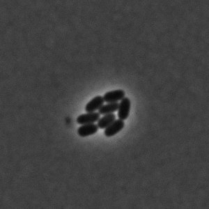

First you must have a grayscale image. If this is not the case, use `grey()` method to grayscale it. Then blur the image. The choice of a blurring technique depends on what kind of image is to blur, but regular blur will do. Be careful while setting the kernel size. If it gets too big, objects' edges and minor details start to deteriorate.

After that, a threshold needs to be defined. It can be defined as an arbitrary value, but we recommend to compute a threshold mask from the image of interest.
Result can vary from one threshold algorithm to another so take a look at a few of them to see which one fits your needs.

Then extrema need to be found and filtered based on their intensity and position. You should get one point per region.

:::caution
Don't forget! If you look for brightest regions then you need to specify `kind` option as `maximum`, if darkest - `minimum`.
:::

With that, you are ready to use watershed. Your code should resemble something like this:

```ts
if (image.colorModel != 'GREY') {
  image = image.grey();
}
let blurredImage = image.blur({ width: 3, height: 3 });
const mask = blurredImage.threshold({ algorithm: 'isodata' });
const points = getExtrema(blurredImage, {
  kind: 'minimum',
  algorithm: 'cross',
  mask,
});
const filteredPoints = removeClosePoints(points, blurredImage, {
  distance: 17,
  kind: 'minimum',
});
const roiMap = waterShed(blurredImage, { points: filteredPoints, mask });
```

This will provide a map of all regions of interest(black ROIs are colored here):

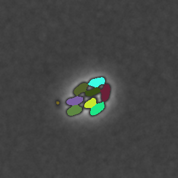

Below you will find a detailed review of all the steps.

## Why is watershed necessary?

[Threshold](../Features/Operations/Threshold.md 'internal link on threshold') is a great segmentation tool for finding objects, but it works only if objects are clearly separated from each other.

Sometimes objects can be too close to each other and the binary image takes it as a giant region of interest, which is not the desired result.

Let's take a look at this image of cell division. The cells here are quite close to each other and if we call a default threshold function and color output regions it will be something like this:

| Input image                                  | What threshold mask looks like              |
| -------------------------------------------- | ------------------------------------------- |
|  | 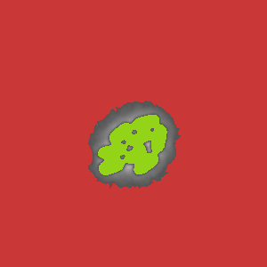 |

Two massive regions while, in reality, there are multiple cells there.  
This is where the watershed algorithm comes in.

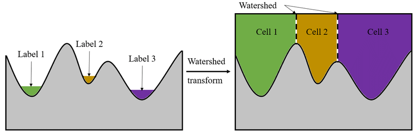

The idea behind watershed is that it treats an image as topographic landscape of intensity where regions of interest's(ROIs') extreme points serve as starting points for basins that should be "filled". Once these basins start getting filled, since they already belong to different regions from the start, even if they touch each other, regions do not get mixed, as if they were limited by a border. Hence is the name: watershed filter.

For instance, here is the same image with applied watershed:

| Input image                                  | What watershed found(in color)                             |
| -------------------------------------------- | ---------------------------------------------------------- |
|  |  |

Nice and clean output, right?

However, if you try to use watershed like this:

```ts
const roiMap = waterShed(image);
```

Most likely, you will extract a mess like this:

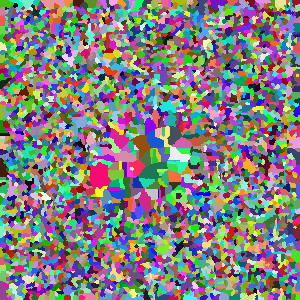

This is because watershed by default finds all the extrema(starting points) without filtering them. You need to filter those starting points beforehand as well as to find a threshold value to localize these regions.

Let's have a look at the necessary elements for a correct regions output.

:::info

Before starting, check the [color model](../Glossary.md#color-model 'internal link on glossary') of an image. If the image is colored, you need to apply grayscale filter, otherwise the watershed algorithm will not work.

```ts
let image = image.grey();
```

You can take a look at different types of grayscale algorithm on [grayscale page](../Features/Filters/Grayscale.md 'internal link on grayscale') in our "Features" section, but a default grayscale should be enough, since the important aspect is for an image to have only one channel.
:::

## Blurring

First thing that you possibly need to do is to remove [image noise](https://en.wikipedia.org/wiki/Image_noise 'wikipedia link on image noise'). It is especially recommended if the image is of poor quality.

ImageJS has several kinds of blurring:

- [blur filter](../Features/Filters/Blur.md)

- [gaussian blur filter](../Features/Filters/Gaussian%20Blur.md)

- [median filter](../Features/Filters/Median.md)

Each filter serves its own purpose, which we will briefly explain.

#### Blur

It is a basic tool that uses a simple average of the neighboring points and replaces point's value with the average. While mean blur is straightforward and computationally efficient, it may not be the best choice in situations where preserving fine details and edges is crucial.
To use it you need to specify width and height of the kernel:

```ts
let blurredImage = image.blur({ width: 3, height: 3 });
```

#### Gaussian blur

As the name suggests it is similar to blur. However, Gaussian blur uses **weighted** average. This means, that the intensity value is also taken into account during computation. It works better than regular blur but it can be slower. It is effective against high-frequency noise.
To use it you need to specify the size of the kernel. This is one of the ways of doing it.

```ts
let blurredImage = image.gaussianBlur({ sigma: 3 });
```

To discover more options you can visit our "Features" page about [gaussian blur](../Features/Filters/Gaussian%20Blur.md 'internal link on gaussian blur').

#### Median

Median filter sorts all the neighbor values in ascending order and sets the pixel to the median value of this array. Unlike blur, median filter is better at preserving image edges and dealing with salt-and-pepper noise, but it performs worse at the image edges.
To use median filter you need to specify the kernel size and the algorithm to treat borders. How the border algorithm works is not really a goal of this tutorial. Just know that this option is mandatory.

```ts
let blurredImage = image.medianFilter({
  cellSize: 3,
  borderType: 'reflect101',
});
```

To discover more options you can visit our "Features" page about [median filter](../Features/Filters/Median.md 'internal link on median').

:::caution
For each technique, kernel size must be an odd number in order for algorithm to find the center correctly!
:::

Honestly speaking, in this particular case, any filter will do fine. But keep in mind that depending on the image, result from these three filters can vary. And do not overdo it. Giving a kernel too big and the filter will deteriorate the image details.
Here you can see blurring with different kernel size(red numbers). By kernel of size 9 it becomes difficult to see the regions' boundaries.

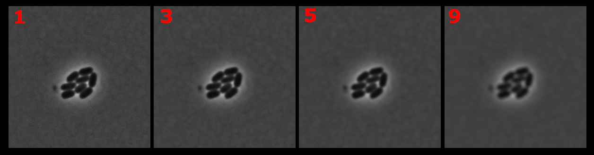

Any further blurring will deteriorate the image completely and make it impossible to find regions correctly.

## Finding threshold mask for watershed

Although threshold mask cannot precisely locate the desired regions, it is a crucial algorithm for successful watershed application because you will be using this mask on multiple occasions to significantly improve your output result. It allows watershed to get a general location of ROIs by separating background from the foreground where objects are situated. This in turn simplifies the search for extrema and borders of the regions.

Here you can see how thresholding works with different algorithms.

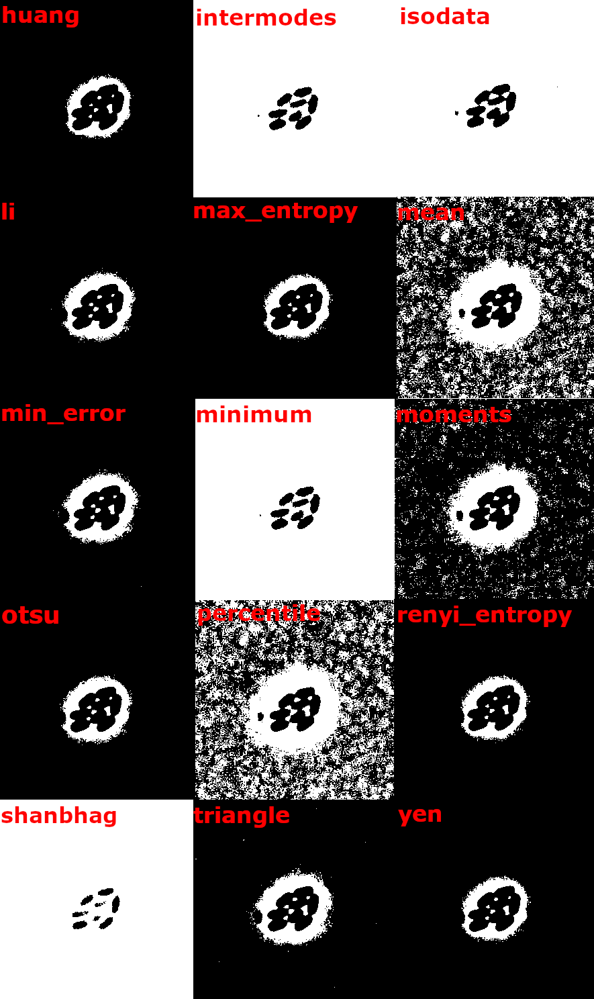

As you can see, different algorithms provide different results. Here we want to analyze the cells in the middle, so a good choice would be `isodata` or `intermodes`.

```ts
const mask = blurredImage.threshold({ algorithm: 'isodata' });
```

## Finding extrema

[Finding extrema](https://en.wikipedia.org/wiki/Maximum_and_minimum 'wikipedia link on extrema') is one of the most crucial aspects for watershed because these are the starting points for each region of interest. However, unfiltered, there can be tens or even hundreds of those on the image, as you can see.

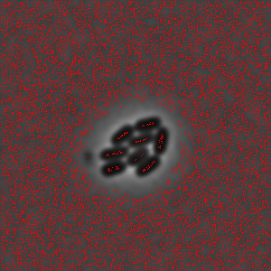

So how to spot the correct ones?

There are two functions that are used for finding extrema: `getExtrema` and `removeClosePoints`.

#### `getExtrema`

This function searches for all local extrema(minima in case of this image). It checks each point for the values around. If all the neighbors are smaller, the point in-check becomes the minima(for maxima it checks if all values are bigger).
In the end it returns all extreme points of the image:

```ts
const points = getExtrema(
  blurredImage,
  { kind: 'minimum', algorithm: 'square' },
  mask,
);
```

:::tip
This is where a mask can be useful. Adding a mask improves the precision of the algorithm, so it is highly recommended to add it as a parameter (Here ROIs are colored for visual aid).

|            Watershed ROIs from extrema without mask            |             Watershed ROIs from extrema with mask             |
| :------------------------------------------------------------: | :-----------------------------------------------------------: |
| 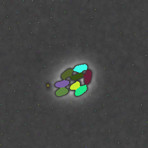 |  |

You can notice small particles that the `getExtrema` picks on. It is not very crucial for visual representation of regions but it is an unnecessary interference if there is a need for more complex analysis. All those spots will be considered as regions of interest as well and you will need to make extra steps to remove them.

:::

In `getExtrema` function there are three algorithm shapes that represent the searching area (checked points are colored in light red):

|                                Algorithm                                 |                          What it is                          |
| :----------------------------------------------------------------------: | :----------------------------------------------------------: |
|     |   Checks extremum in 4 directions: up,down,left and right.   |
|  |        Checks extremum within all neighboring points.        |
|        | Checks extremum beyond the neighbors within main directions. |

The chosen algorithm changes the size of the area that it checks.

But even with this, `getExtrema` can only give us a smaller number of local extrema. Moreover, if overdone, it can neglect certain extrema that would be considered correct.

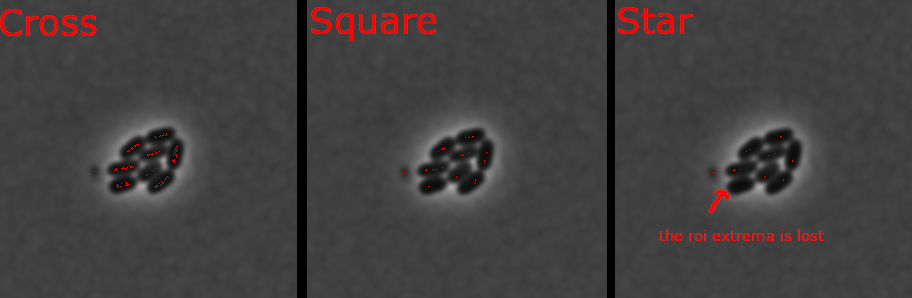

#### `removeClosePoints`

This is where another function can be used: `removeClosePoints`. With `distance` option this function can weed out local minima so that only those points that are within bigger or equal distance are left.

As you can see, depending on the distance between points, number of extrema gets reduced to the correct amount. Just like with `getExtrema` algorithms, do not overdo it. With a distance too big between extrema, you will inevitably lose some regions of interest.

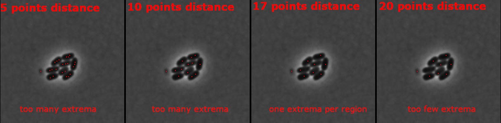

With some fine-tuning of those two functions you should get the correct number of minima.
For instance, in case of this image, extrema can be obtained with these parameters:

```ts
//Don't forget to explicitly specify the kind of points you are looking for.
const points = getExtrema(
  blurredImage,
  { kind: 'minimum', algorithm: 'cross' },
  mask,
);
const filteredPoints = removeClosePoints(points, blurredImage, {
  distance: 17,
  kind: 'minimum',
});
```

And this is how extrema will now be situated:

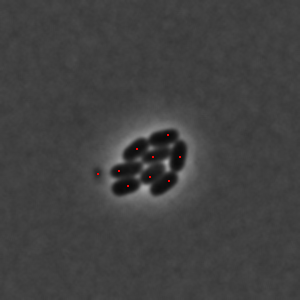

## Applying watershed

At this point we covered every important parameter for watershed to work, so all is left is to apply extrema and mask that we calculated before:

```ts
const roiMap = waterShed(blurredImage, { points: filteredPoints, mask });
```

After extracting black ROIs you will receive these regions(colored):


:::info
It is worth mentioning, however, that mask is not the only way of finding ROIs through watershed. Another way of applying watershed is to pass the threshold value directly. While looking for threshold we looked for a mask, but we can also find the threshold value that the mask is based on.  
Thus, by using `computeThreshold()` function we can pass its result like this:

```ts
//Mask was using `isodata` algorithm, so we use the same algorithm here.
const thresholdValue = computeThreshold(blurredImage, 'isodata');
//Watershed's threshold option is an index between 0 and 1.
//So you need to divide the received value from computeThreshold by
//maximum value of an image to receive the ratio.
const roiMap = waterShed(blurredImage, {
  points: filteredPoints,
  threshold: thresholdValue / image.maxValue,
});
```

It will provide the same result as if a threshold mask was used.
:::
