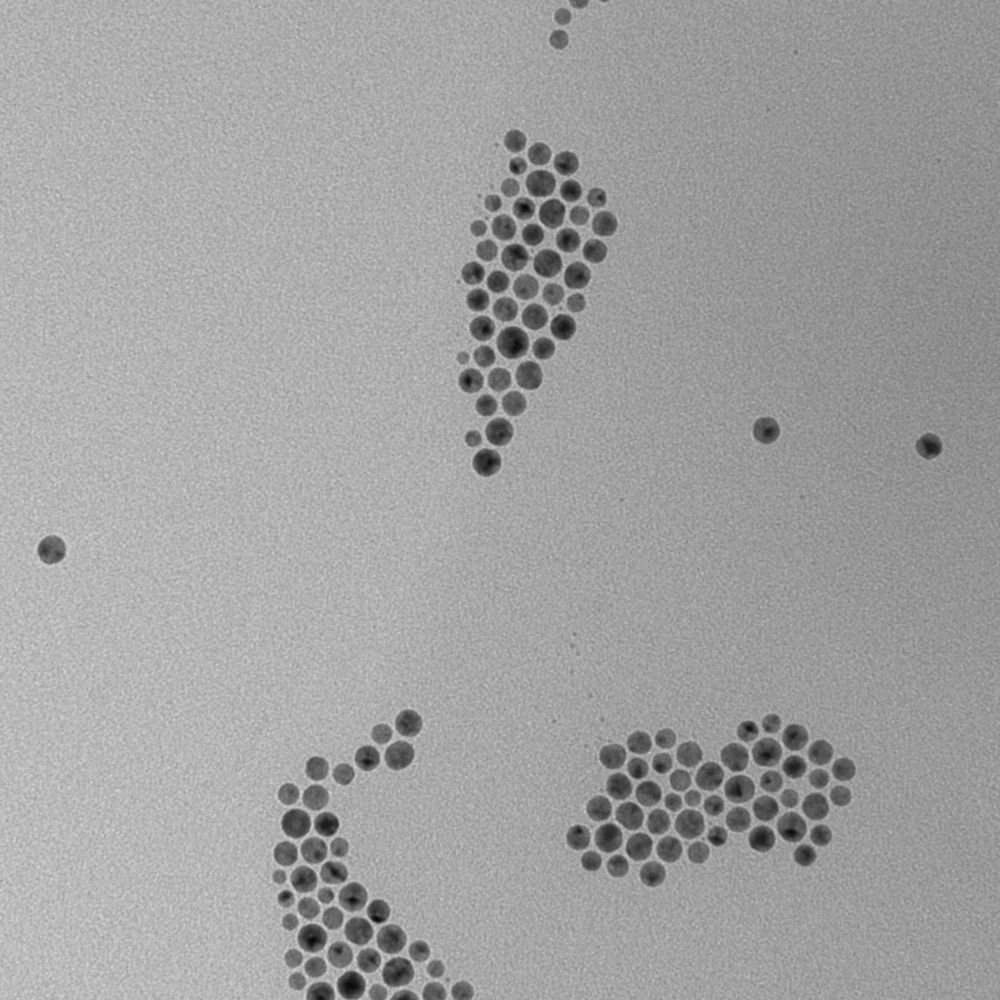
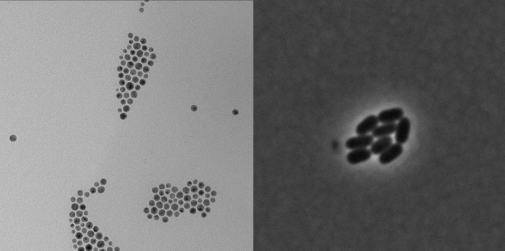
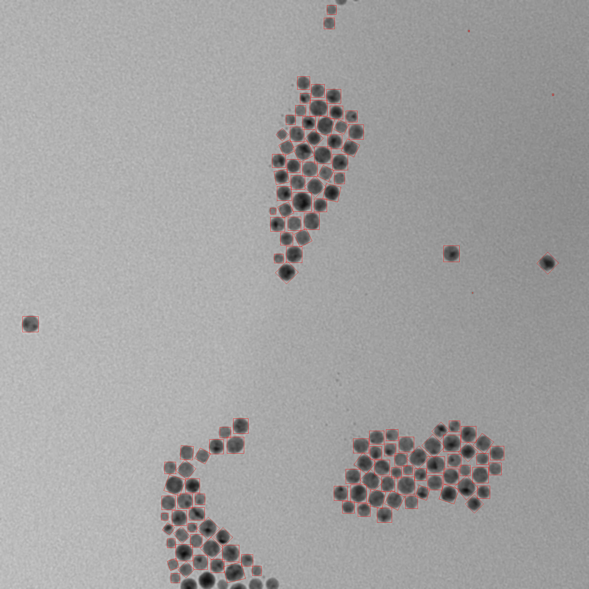
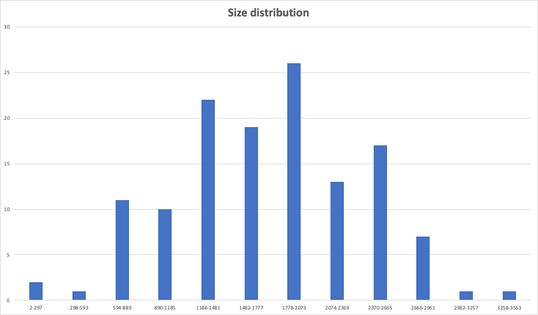
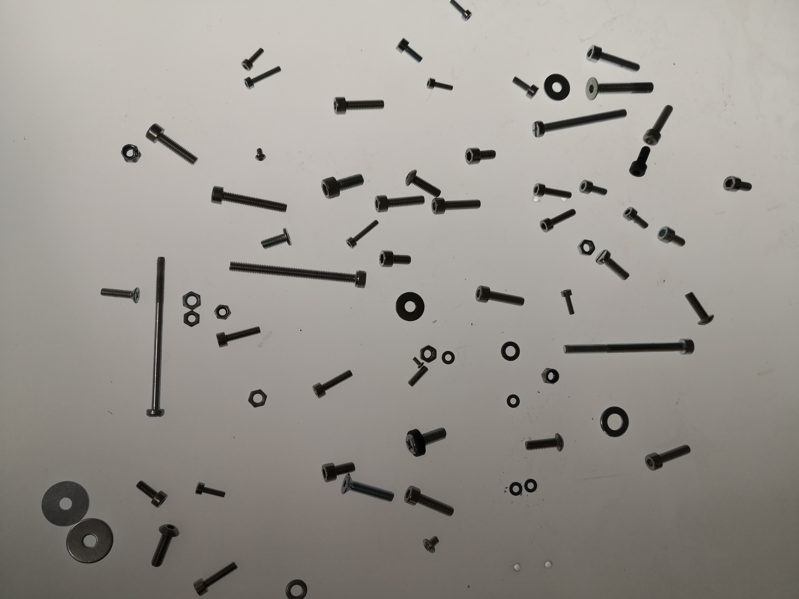
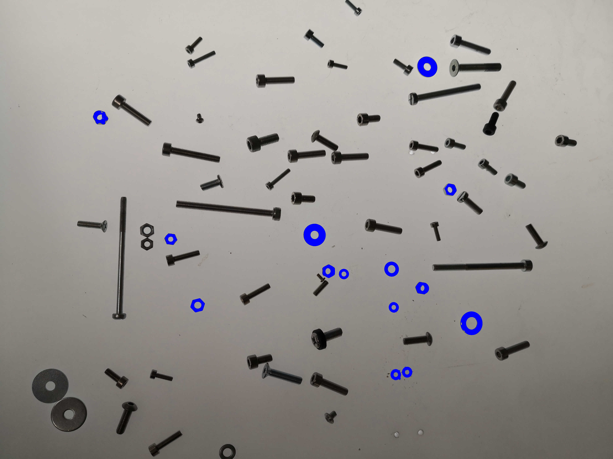
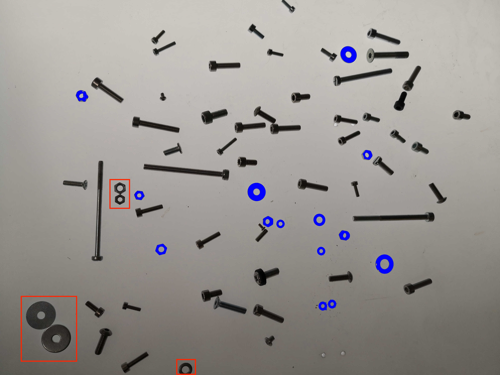
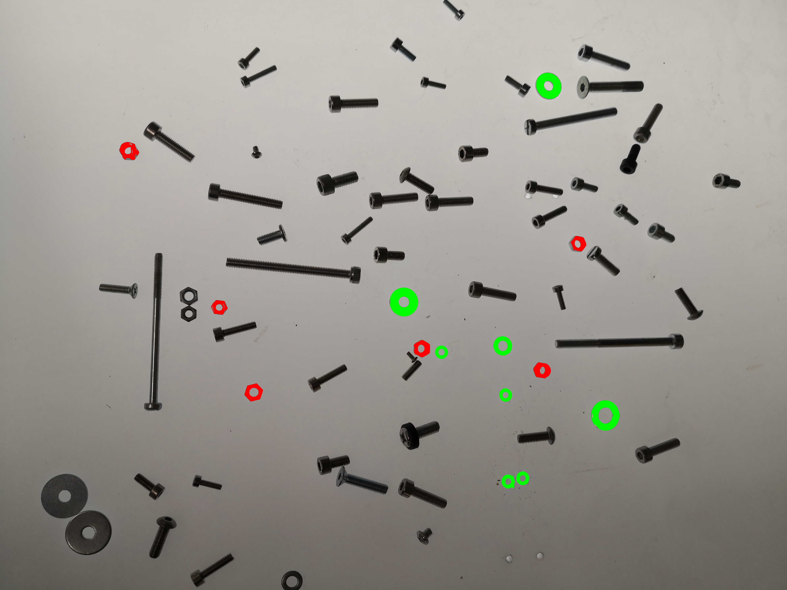

ROI (Regions of Interest) analysis is probably a topic too vast to fit it completely in one tutorial. But we will try to give you the basic idea of what image analysis might look like.
First, let's take an image of particles made by electronic microscope as our example. The idea will be to sort regions by size to see how particles are distributed within different intervals. It is called size distribution, which is an important aspect for particle analysis in a lot of industries, such as geology, pharmaceuticals, cosmetics, food industry etc.



## Getting Regions of Interest

To get ROIs, first you need to find ROI map. There are two general ways of doing it. First one is `threshold` method which works well for images where background and foreground are well defined and elements are placed separately from each other:

```ts
const mask = image.threshold();
const roiMap = fromMask(mask);
```

Second option is `watershed` function. If an image has many adjacent elements, using `watershed` might be a better option:

```ts
const roiMap = watershed(image, { points, mask });
```

You can see a good image to use threshold on the left and an image for watershed on the right.



:::caution
Before taking on the analysis of regions of interest we recommend to take a look at the tutorials for `watershed` and `threshold`.
:::

First we need to extract regions of interest from a map for further analysis:

```ts
//in this case we are interested in dark regions of interest, so we
//specify the kind of ROIs we want to extract.
const rois = roiMap.getRois({ kind: 'black' });
```

:::tip
For `getRois()` method you can use options `minSurface` and `maxSurface` to filter the ROIs by surface size.

```ts
const rois = roiMap.getRois({ kind: 'black', minSurface: 1000 });
```

If you have specific size interval in mind, this might come in handy.

:::

## Getting distribution by size

Now we have all the regions identified and stored. We can work on the analysis of those regions.



As was mentioned before size distribution analysis can be an important piece of data so we will do that .
First we need to find the limits of our sample.

```ts
const maxSurface = Math.max(...rois.map((roi) => roi.surface));
const minSurface = Math.min(...rois.map((roi) => roi.surface));
```

After that we can calculate the span of our sample:

```ts
const span = maxSurface - minSurface;
```

Then we will have the width of intervals (classes). There is no particular rule of how to choose it and you are free to choose your own class sizes, but the rule of thumb would be to use this formula:

```ts
//We round up the interval for simplicity. You can also make it
//a multiple of 10 if you want.
const interval = span / Math.sqrt(rois.length);
```

After that we can find how many ROIs belong to each interval.

```ts
const bySizeDistribution = new Map();

for (let i = minSurface; i < maxSurface; i += interval) {
  const count = rois.filter((roi) => {
    return roi.surface >= i && roi.surface < i + interval;
  }).length;
  const intervalString = i + '-' + (i + interval);
  bySizeDistribution.set(intervalString, {
    frequency: count,
    percentage: ((count / rois.length) * 100).toFixed(2),
  });
}
```

Now you have a data about size distribution in our sample:



| Interval (points) | Frequency | Percentage (%) |
| ----------------- | --------- | -------------- |
| 174-451           | 2         | 1.47           |
| 451-728           | 13        | 9.56           |
| 726-1005          | 7         | 5.15           |
| 1005-1282         | 16        | 11.76          |
| 1282-1559         | 19        | 13.97          |
| 1559-1836         | 21        | 15.44          |
| 1836-2113         | 20        | 14.71          |
| 2113-2390         | 12        | 8.82           |
| 2390-2667         | 16        | 11.76          |
| 2667-2944         | 8         | 5.88           |
| 2944-3221         | 1         | 0.74           |
| 3221-3498         | 1         | 0.74           |

Here you have a basic example of how to calculate size distribution of particles. Even with this we can receive data like predominant particle size or size range, which can already give insights about properties of a sample. But in ImageJS we are not limited to analyze samples by size, there exist more advanced techniques that we will discuss further.

## Analyzing regions with other properties and features

Size is not the only parameter that can be used to filter and analyze regions. Analysis tools can also be used to distinguish different regions by their properties.
For the tutorial's sake let's take a more trivial example. Here we have a bunch of fasteners. Let's take a look at how we can group washers and nuts as well as distinguish them from each other.



The obvious distinction here between washers, nuts and other elements is the fact that they have holes in them. In this case we can use `fillRatio` property which gives a ratio of ROIs surfaces with and without holes. However, a better solution might be applying `holesInfo()` method to see the information about how many holes a region possesses.
To make sure that we will get only washers and nuts we will also take their form factor into account and use `roundness` property. Roundness quantifies the deviation of an object's shape from a perfect circle. So, if the roundness of the perfect circle is 1, let's use 0.6 as a measure for our regions.

:::tip
It is reasonable to assume that you don't know exactly what is the exact roundness coefficient of a washer, so you will eyeball it to see if your guess is close enough or not.
To visualize it better you can use `paintMask()` method to paint a mask of a region of interest on the image. Don't forget to indicate ROIs origin and color of your choice, otherwise the result might be subpar.
:::

```ts
let mask = sourceImage
  .gaussianBlur({ sigma: 0.25 })
  .grey()
  //renyiEntropy looks like a better choice of algorithm
  //here. Check multiple algorithms to see which one
  //fits your needs best.
  .threshold({ algorithm: 'renyiEntropy' });
//We are using clearBorder is a good practice for image analysis
//because often borderline objects and therefore useless for
//analysis.
mask = clearBorder(mask, { color: 'black' });
const roiMap = fromMask(mask);
const rois = roiMap.getRois({ kind: 'black' });
//Making a copy to not overwrite the existing image.
let image = sourceImage;
const washersAndNuts = [];
for (const roi of rois) {
  if (roi.holesInfo().number >= 1 && roundness > 0.6 && ) {
    //paintMask allows painting regions of interest on our
    //image. We recommend using it for highlighting regions
    //and for visual aid.
    image = image.paintMask(roi.getMask(), {
      origin: { column: roi.origin.column, row: roi.origin.row },
      color: [0, 0, 255, 255],
    });
  }
}
```

With this we will have our nuts and washers **ready for analysis**.



There might be confusion about why some of the regions were left out. There are several reasons for that. Our primary goal here is to analyze specific and separate objects. However, here washers and nuts are adjacent to each other
and will be considered as one object which defeat the whole purpose of the analysis. Another reason is the fact that regions at the image borders might be represented only partially which is the case with the washer below. Part of it is out of the frame, which
obviously tampers its ROI properties.



Now we need to distinguish washers from nuts. To do so, we will use the aspect ratio of [minimum bounding rectangle](../Features/Regions%20of%20interest/MBR.md 'internal link on mbr') (MBR). The MBR is the smallest rectangle that can fit our region. Its aspect ratio will help us deduce whether it is a hexagon or a circle.
So, we will add some additional conditions to sort our regions. Methodically looking for the limit aspect ratio, we deduced that the threshold between a nut and a washer is approximately 0.932. It is not the most straight-forward value to find, and we found it empirically, by looking at MBR aspects of all ROIs and deducing the threshold between two kinds of fasteners. So the only thing left is to sort them into different arrays:

```ts
const washers = [];
const nuts = [];
for (const roi of washersAndNuts) {
  //to see each aspect ratio you can
  //use console.log(roi.mbr.aspectRatio);
  if (roi.mbr.aspectRatio > 0.932) {
    nuts.push(roi);
    image = image.paintMask(roi.getMask(), {
      origin: {
        column: roi.origin.column,
        row: roi.origin.row,
      },
      color: [0, 255, 0, 255],
    });
  } else {
    washers.push(roi);
    image = image.paintMask(roi.getMask(), {
      origin: {
        column: roi.origin.column,
        row: roi.origin.row,
      },
      color: [255, 0, 0, 255],
    });
  }
}
```

With this we will get the desired result. All nuts and washers are found and sorted for analysis.



And to get to this point we get a code like this:

```ts
let mask = sourceImage
  .gaussianBlur({ sigma: 3, size: 3 })
  .grey()
  .threshold({ algorithm: 'renyiEntropy' });
mask = clearBorder(mask, { allowCorners: false, color: 'black' });
const roiMap = fromMask(mask);
const rois = roiMap.getRois({ kind: 'black' });
let image = sourceImage;
const washersAndNuts = [];
// part where elements get picked apart from
//bolts and screws
for (const roi of rois) {
  if (roi.holesInfo.number >= 1 && roi.roundness > 0.6) {
    console.log(roi.id, roi.roundness, roi.mbr.aspectRatio);
    image = image.paintMask(roi.getMask(), {
      origin: { column: roi.origin.column, row: roi.origin.row },
      color: [255, 0, 0, 255],
    });
    washersAndNuts.push(roi);
  }
}
//part where elements are distinguished
const washers = [];
const nuts = [];
for (const roi of washersAndNuts) {
  if (roi.mbr.aspectRatio > 0.932) {
    nuts.push(roi);
    image = image.paintMask(roi.getMask(), {
      origin: {
        column: roi.origin.column,
        row: roi.origin.row,
      },
      color: [0, 255, 0, 255],
    });
  } else {
    washers.push(roi);
    image = image.paintMask(roi.getMask(), {
      origin: {
        column: roi.origin.column,
        row: roi.origin.row,
      },
      color: [255, 0, 0, 255],
    });
  }
}
```

These are some of the basic elements of ROI analysis.

| ID   | MBR Aspect Ratio   | Roundness          | Type of object |
| ---- | ------------------ | ------------------ | -------------- |
| -334 | 0.8486055776892426 | 0.7395141926907502 | nut            |
| -189 | 0.8571428571428572 | 0.6362497879977436 | nut            |
| -346 | 0.8573883161512026 | 0.6415420901951657 | nut            |
| -225 | 0.8606205250596659 | 0.620587471293423  | nut            |
| -233 | 0.9248120300751881 | 0.5964629322266488 | nut            |
| -262 | 0.9318181818181818 | 0.6843448451890717 | nut            |
| -356 | 0.9342105263157895 | 0.6633150795404446 | nut            |
| -297 | 0.9428571428571428 | 0.5931423404475458 | washer         |
| -311 | 0.9590909090909098 | 0.6970505527744227 | washer         |
| -337 | 0.9621212121212122 | 0.7566368727646887 | washer         |
| -289 | 0.9690721649484533 | 0.6784922893542326 | washer         |
| -268 | 0.9701492537313433 | 0.7137816522045993 | washer         |
| -296 | 0.9701492537313433 | 0.7268334194156458 | washer         |
| -255 | 0.9793103448275862 | 0.8277530015726191 | washer         |

However, this is just a fraction of tools that ImageJS possesses. There are other properties that you can discover more about in our [API features](../Features/Regions%20of%20interest/Regions%20of%20interest.md) section. Here is an example of the properties that you can use with any region of interest:

| Feature         | Type         | Value                                                                  |
| --------------- | ------------ | ---------------------------------------------------------------------- |
| `id`            | `number`     | -75                                                                    |
| `origin`        | `Point`      | `{ row: 2390, column: 206 }`                                           |
| `height`        | `number`     | 411                                                                    |
| `width`         | `number`     | 358                                                                    |
| `surface`       | `number`     | 78022                                                                  |
| `eqpc`          | `number`     | 315.18359056163894                                                     |
| `ped`           | `number`     | 469.58631480264023                                                     |
| `feret`         | `Feret`      | `feret: {minDiameter, maxDiameter, aspectRatio}`                       |
| `fillRatio`     | `number`     | 0.9239277171210004                                                     |
| `sphericity`    | `number`     | 0.671194156699617                                                      |
| `roundness`     | `number`     | 0.5064165481909365                                                     |
| `solidity`      | `number`     | 0.8081705794917212                                                     |
| `perimeter`     | `number`     | 1475.2489168102784                                                     |
| `convexHull`    | `ConvexHull` | `convexHull: {points,perimeter,surface}`                               |
| `mbr`           | `Mbr`        | `mbr: {points, surface, angle, width, height, perimeter, aspectRatio}` |
| `filledSurface` | `number`     | 84446,                                                                 |
| `centroid`      | `Point`      | `{ column: 385.2887262566968, row: 2593.7994283663584 }`               |
