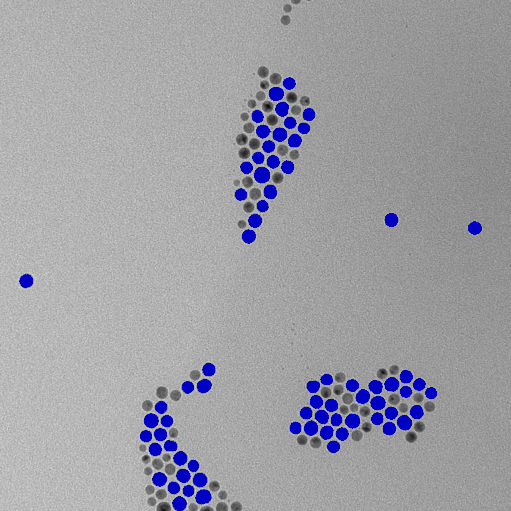
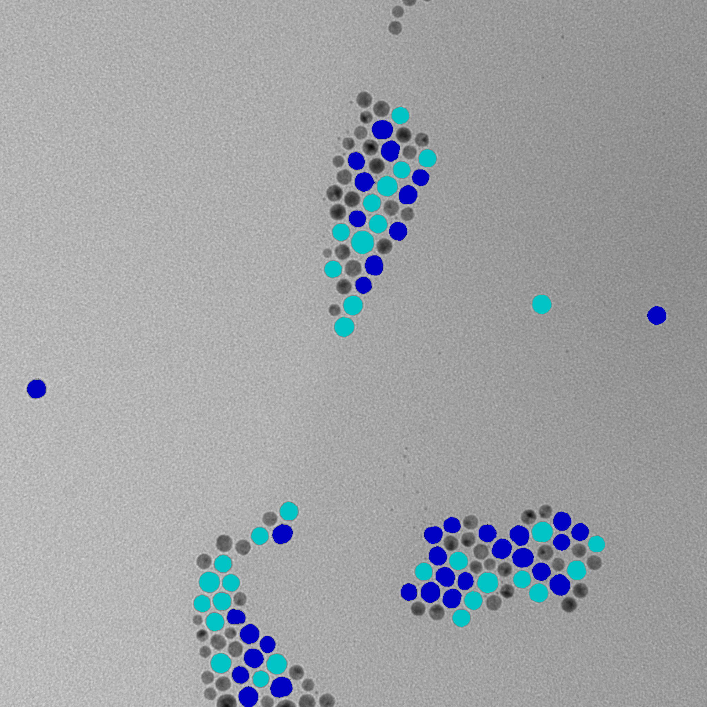

In this tutorial we will talk about regions of interest, how to extract them and how to analyze them on an actual example.

## Regions' analysis

As a reminder, to get ROIs, first you need to find ROI map. To do so, you can either use `threshold` method:

```ts
const mask = image.threshold();
const roiMap = fromMask(mask);
```

or, if an image has small elements that are touching each other, use `watershed` function:

```ts
const roiMap = watershed(image, { points, mask });
```

You can see a good image to use threshold on the left and an image for watershed on the right.


:::caution
Before taking on the analysis of regions of interest we recommend to take a look at the tutorials for `watershed` and `threshold`.
:::

For the sake of simplicity we will use the same example as in a threshold method. However, we will put a little twist and use an image of [TIFF](https://en.wikipedia.org/wiki/TIFF 'wikipedia link on .tiff format') format. This format is great for storing and editing images of high quality. It also allows adding metadata with extensive information about an image which we will examine a bit further in this tutorial. But for now let's take one step at a time.  
To get regions of interest you need to extract them from a map:

```ts
//in this case we are interested in dark regions of interest, so we
//specify the kind of ROIs we want to extract.
const rois = roiMap.getRois({ kind: 'black' });
```

:::tip
For `getRois()` method you can use options `minSurface` and `maxSurface` to filter the ROIs by surface size.

```ts
const rois = roiMap.getRois({ kind: 'black', minSurface: 1000 });
```

:::

Now we have all the regions identified and stored. We can work on the analysis of those regions.


To do so we need to understand what kind of analysis is necessary. Depending on the answer, different tools can be used. Let's say we want to filter regions by size and shape.
For filtering by size the process is rather straight-forward. You can use the `getRois()` options, as was mentioned above, or you can use region's perimeter and surface properties to filter the ROIs. We can detect
In this example let's get the regions which are above an average size of the `rois` sample.
First we need to find this average. It can be done like this:

```ts
let surfaceSum = 0;
for (const roi of rois) {
  surfaceSum += roi.surface;
}
const avgSurface = surfaceSum / rois.length;
```

After that we can get regions that are above the average size:

```ts
const biggestRois = [];
const biggestRois = rois.filter((roi) => {
  return roi.surface >= avgSurface;
});
//since our image is of grey color model, we need to convert
//it into 'RGB' model to color it. Otherwise, we will get an error
// if we try to put an rgb color to a grey image.
const coloredRoisImage = image.convertColor('RGB');
for (const roi of biggestRois) {
  //The image is of 16 bit depth, so the channel values are
  //between 0 and 65535. Here we will receive a shade of blue.
  coloredRoisImage = image.paintMask(roi.getMask(), {
    color: [0, 0, 50000],
    origin: { column: roi.origin.column, row: roi.origin.row },
  });
}
```

:::caution
It is important to put origin as a parameter. If not specified, the origin of the whole image will be considered as one,so your mask will probably be painted somewhere in the top left
corner regardless of your ROI position.
:::

:::info
You can also use `paintMaskOnImage` function to do the same thing:

```ts
coloredRoisImage = paintMaskOnImage(image, roi.getMask(), {
  color: [0, 0, 50000],
  origin: { column: roi.origin.column, row: roi.origin.row },
});
```

:::



This provides us with a certain number of regions (colored in blue). The selected regions can be investigated further. For instance, we can use property like `roundness` to see how close the region's shape is to a circle. Let's put 0.9 as a limit (the coefficient for a perfect circle will be 1).

```ts
let roundestRois = [];
const roundestRois = biggestRois.filter((roi) => {
  return roi.roundness > 0.9;
});
```

After that we can paint the rois with a different color the same manner we did before to highlight the "roundest" regions.

```ts
for (const roi of roundestRois) {
  coloredRoisImage = image.paintMask(roi.getMask(), {
    color: [0, 50000, 50000],
    origin: { column: roi.origin.column, row: roi.origin.row },
  });
```



This provides us with a code like this:

```ts
const rois = roiMap.getRois({ kind: 'black' });
// In this example we want to specifically calculate
//the average surface of rois, so we don't use
// minSurface option here.

let surfaceSum = 0;
for (const roi of rois) {
  surfaceSum += roi.surface;
}
const avgSurface = surfaceSum / rois.length;

const biggestRois = rois.filter((roi) => {
  return roi.surface >= avgSurface;
});
const roundestRois = biggestRois.filter((roi) => {
  return roi.roundness > 0.9;
});
const coloredRoisImage = image.convertColor('RGB');
for (const roi of biggestRois) {
  coloredRoisImage = image.paintMask(roi.getMask(), {
    color: [0, 0, 50000],
    origin: { column: roi.origin.column, row: roi.origin.row },
  });
}
for (const roi of roundestRois) {
  coloredRoisImage = image.paintMask(roi.getMask(), {
    color: [0, 50000, 50000],
    origin: { column: roi.origin.column, row: roi.origin.row },
  });
}
```

An image above highlights the ROIs that we found. Dark blue regions represent the particles that were above the average that we calculated. The light blue particles are the particles with an above average size and roundness above 0.9.
This is just a fraction of tools that ImageJS possesses. There are many other properties that you can discover more about in our [API features](../Features/Regions%20of%20interest/Regions%20of%20interest.md) section. Here is an example of the properties that you can use with any region of interest:

| Feature         | Type         | Value                                                                  |
| --------------- | ------------ | ---------------------------------------------------------------------- |
| `id`            | `number`     | -128                                                                   |
| `origin`        | `Point`      | `{ row: 1547, column: 1602 }`                                          |
| `height`        | `number`     | 48                                                                     |
| `width`         | `number`     | 50                                                                     |
| `surface`       | `number`     | 1814                                                                   |
| `eqpc`          | `number`     | 48.05888611016266                                                      |
| `ped`           | `number`     | 50.64165599181419                                                      |
| `feret`         | `Feret`      | `feret: {minDiameter, maxDiameter, aspectRatio}`                       |
| `fillRatio`     | `number`     | 1                                                                      |
| `sphericity`    | `number`     | 0.9489991029900559                                                     |
| `roundness`     | `number`     | 0.8948688625143686,                                                    |
| `solidity`      | `number`     | 0.9674666666666667                                                     |
| `perimeter`     | `number`     | 159.095454429505                                                       |
| `convexHull`    | `ConvexHull` | `convexHull: {points,perimeter,surface}`                               |
| `mbr`           | `Mbr`        | `mbr: {points, surface, angle, width, height, perimeter, aspectRatio}` |
| `filledSurface` | `number`     | 1814                                                                   |
| `centroid`      | `Point`      | `{ column: 1626.577177508269, row: 1570.2546857772877 }`               |
