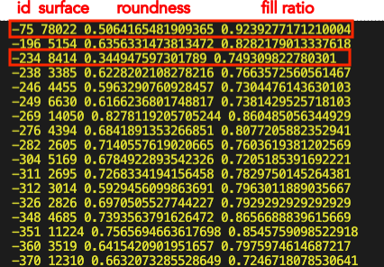
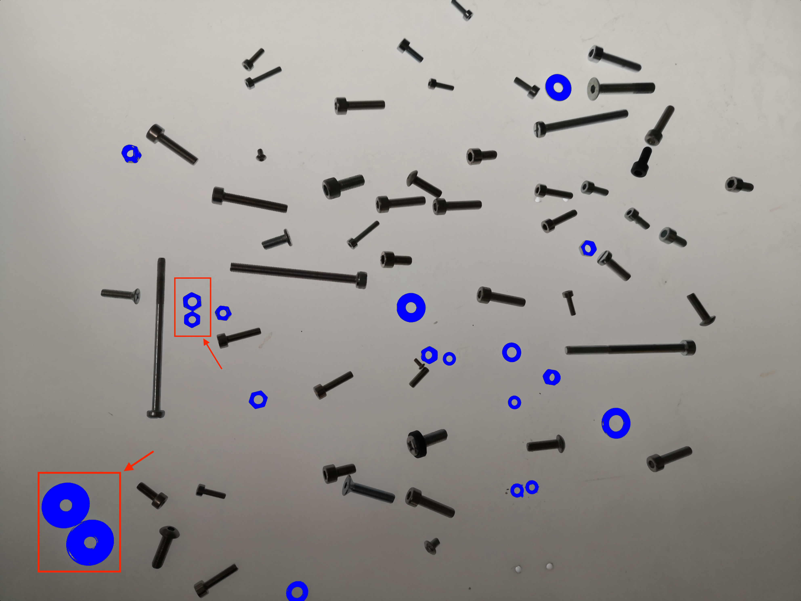

In this tutorial we will talk about regions of interest, how to extract them and how to analyze them on an actual example.

## Regions' analysis

### Getting ROIs

As a reminder, to get ROIs, first you need to find ROI map. To do so, you can either use `threshold` method:

```ts
const mask = image.threshold();
const roiMap = fromMask(mask);
```

or, if an image has small elements that are touching each other, use `watershed` function:

```ts
const roiMap = watershed(image, { points, mask });
```

You can see a good image to use threshold on the left and an image for watershed on the right.


:::caution
Before taking on the analysis of regions of interest we recommend to take a look at the tutorials for `watershed` and `threshold`.
:::

For the sake of simplicity we will use the same example as in a threshold method. However, we will put a little twist and use an image of [TIFF](https://en.wikipedia.org/wiki/TIFF 'wikipedia link on .tiff format') format. This format is great for storing and editing images of high quality. It also allows adding metadata with extensive information about an image which we will examine a bit further in this tutorial. But for now let's take one step at a time.  
To get regions of interest you need to extract them from a map:

```ts
//in this case we are interested in dark regions of interest, so we
//specify the kind of ROIs we want to extract.
const rois = roiMap.getRois({ kind: 'black' });
```

:::tip
For `getRois()` method you can use options `minSurface` and `maxSurface` to filter the ROIs by surface size.

```ts
const rois = roiMap.getRois({ kind: 'black', minSurface: 1000 });
```

:::

### Getting distribution by size

Now we have all the regions identified and stored. We can work on the analysis of those regions.


To do so we need to understand what kind of analysis is necessary. Depending on the answer, different tools can be used. Let's say we want to filter regions by size and shape.
To do that we can use surface and some basics from statistics. Let's calculate the size distribution of our ROIs.  
First we need to find the limits of our sample.

```ts
const maxSurface = Math.max(...rois.map((roi) => roi.surface));
const minSurface = Math.min(...rois.map((roi) => roi.surface));
```

After that we can calculate the span of our sample:

```ts
const span = maxSurface - minSurface;
```

Then the width of intervals we will have(classes). There is no particular rule of how to choose it, but this formula is a rule of thumb:

```ts
//We round up the interval for simplicity. You can also make it
//a multiple of 10 if you want.
const interval = span / Math.sqrt(rois.length);
```

After that we can find how many ROIs belong to each interval. To make it more visually clear we will use a map.

```ts
const bySizeDistribution = new Map();

for (let i = minSurface; i < maxSurface; i += interval) {
  const count = rois.filter((roi) => {
    return roi.surface >= i && roi.surface < i + interval;
  }).length;
  const intervalString = i + '-' + (i + interval);
  bySizeDistribution.set(intervalString, {
    frequency: count,
    percentage: ((count / rois.length) * 100).toFixed(2),
  });
}
```

Now you have a data about size distribution in our sample:


| Interval (points) | Frequency | Percentage (%) |
| ----------------- | --------- | -------------- |
| 174-451           | 2         | 1.47           |
| 451-728           | 13        | 9.56           |
| 726-1005          | 7         | 5.15           |
| 1005-1282         | 16        | 11.76          |
| 1282-1559         | 19        | 13.97          |
| 1559-1836         | 21        | 15.44          |
| 1836-2113         | 20        | 14.71          |
| 2113-2390         | 12        | 8.82           |
| 2390-2667         | 16        | 11.76          |
| 2667-2944         | 8         | 5.88           |
| 2944-3221         | 1         | 0.74           |
| 3221-3498         | 1         | 0.74           |

### Analyzing regions with roundness and fill ratio

Size is not the only parameter that can be used to filter and analyze regions.
Let's take a more trivial example and have a look at how such properties like fill ratio and roundness will work on this image of fasteners:


The obvious distinction here between washers,nuts and other bolts is the fact that they have holes in them. In this case we can use fill ratio. Fill ratio is the ratio between the actual filled space and the total available space.
So, if we take and filter regions by, let's say, 0.9 as a fill ratio we will get something like this.

```ts
const mask = sourceImage
  .blur({ width: 3, height: 3 })
  .grey()
  //renyiEntropy looks like a better choice of algorithm
  //here. Check multiple algorithms to see which one
  //fits your needs best.
  .threshold({ algorithm: 'renyiEntropy' });

const roiMap = fromMask(mask);
const rois = roiMap.getRois({ kind: 'black' });
//Making a copy to not overwrite the existing image.
let image = sourceImage;

for (const roi of rois) {
  if (roi.fillRatio < 0.9) {
    //paintMask allows painting regions of interest on our
    //image. We recommend using it for highlighting regions
    //and for visual aid.
    image = image.paintMask(roi.getMask(), {
      origin: { column: roi.origin.column, row: roi.origin.row },
      color: [0, 0, 255, 255],
    });
  }
}
```


As you can see the result is decent, but there are two big washers in the bottom-left corner that were not captured. We don't know the correct values for fill ratio of the washer, so it's normal to make some "guesses" for optimal result.
But then, as you can see, there is now a bolt that was also considered as a washer/nut.


It's due to the fact that our threshold mask has considered the reflected glow from it as a hole, so it's fill ratio is smaller than 1, even though this is not really the case.

It's fine though, we can be more specific with what we are looking for. We will now add another option, which is object's roundness. This is a property that checks how close the ROIs shape resembles a perfect circle(which means roundness equals to 1). It is reasonable to believe that washers and nuts are more round than other objects after all.
So we slightly modify our code and add another condition:

```ts
const mask = sourceImage
  .blur({ width: 3, height: 3 })
  .grey()
  //renyiEntropy looks like a better choice of algorithm
  //here. Check multiple algorithms to see which one
  //fits your needs best.
  .threshold({ algorithm: 'renyiEntropy' });

const roiMap = fromMask(mask);
const rois = roiMap.getRois({ kind: 'black' });
//Making a copy to not overwrite the existing image.
let image = sourceImage;

for (const roi of rois) {
  if (roi.fillRatio < 0.95 && roi.roundness >= 0.3) {
    //paintMask allows painting regions of interest on our
    //image. We recommend using it for highlighting regions
    //and for visual aid.
    image = image.paintMask(roi.getMask(), {
      origin: { column: roi.origin.column, row: roi.origin.row },
      color: [0, 0, 255, 255],
    });
  }
}
```


We will get the desired result with this. But I think there are a few things that should be clarified. You might have noticed that roundness limit is rather low. Well, if you put all the roundness values of the ROIs that we found you will see one aberration.



This is because of one particular ROI right here.



The reason for that is the fact that our threshold algorithm considers it as one region, which in turn reduces its roundness value.

/////////////////////////////

An image above highlights the ROIs that we found. Dark blue regions represent the particles that were above the average that we calculated. The light blue particles are the particles with an above average size and roundness above 0.9.
This is just a fraction of tools that ImageJS possesses. There are many other properties that you can discover more about in our [API features](../Features/Regions%20of%20interest/Regions%20of%20interest.md) section. Here is an example of the properties that you can use with any region of interest:

| Feature         | Type         | Value                                                                  |
| --------------- | ------------ | ---------------------------------------------------------------------- |
| `id`            | `number`     | -128                                                                   |
| `origin`        | `Point`      | `{ row: 1547, column: 1602 }`                                          |
| `height`        | `number`     | 48                                                                     |
| `width`         | `number`     | 50                                                                     |
| `surface`       | `number`     | 1814                                                                   |
| `eqpc`          | `number`     | 48.05888611016266                                                      |
| `ped`           | `number`     | 50.64165599181419                                                      |
| `feret`         | `Feret`      | `feret: {minDiameter, maxDiameter, aspectRatio}`                       |
| `fillRatio`     | `number`     | 1                                                                      |
| `sphericity`    | `number`     | 0.9489991029900559                                                     |
| `roundness`     | `number`     | 0.8948688625143686,                                                    |
| `solidity`      | `number`     | 0.9674666666666667                                                     |
| `perimeter`     | `number`     | 159.095454429505                                                       |
| `convexHull`    | `ConvexHull` | `convexHull: {points,perimeter,surface}`                               |
| `mbr`           | `Mbr`        | `mbr: {points, surface, angle, width, height, perimeter, aspectRatio}` |
| `filledSurface` | `number`     | 1814                                                                   |
| `centroid`      | `Point`      | `{ column: 1626.577177508269, row: 1570.2546857772877 }`               |
