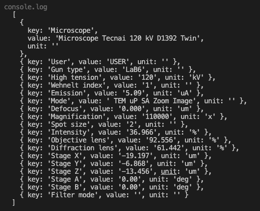
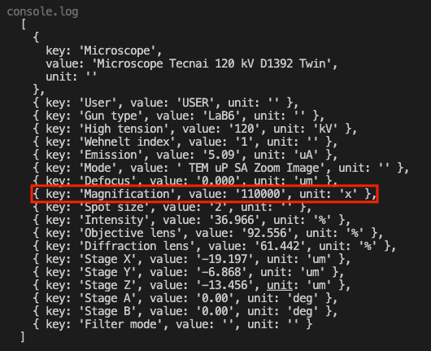

In this tutorial we will talk about regions of interest, how to extract them and how to analyze them on an actual example.

## Regions' analysis

As a reminder, to get ROIs, first you need to find ROI map. To do so, you can either use `threshold` method:

```ts
const mask = image.threshold();
const roiMap = fromMask(mask);
```

or, if an image has more complex background and many small elements positioned closely to each other, use `watershed` function:

```ts
const roiMap = watershed(image, { points, mask });
```

You can see a good image to use threshold (on the left) and an image for watershed (on the right).


:::caution
Before taking on the analysis of regions of interest we recommend to take a look at the tutorials for `watershed` and `threshold`.
:::

For the sake of simplicity we will use the same example as in a threshold method. However, we will put a little twist and use an image of [TIFF](https://en.wikipedia.org/wiki/TIFF 'wikipedia link on .tiff format') format. This format is great for storing and editing images. It also allows adding metadata with extensive information about an image which we will examine a bit further in this tutorial. But for now let's take one step at a time.
To get regions of interest you need to extract them from a map:

```ts
//in this case we are interested in dark regions of interest, so we
//specify the kind of ROIs we want to extract.
const rois = roiMap.getRois({ kind: 'black' });
```

:::tip
For `getRois()` method you can use options `minSurface` and `maxSurface` to filter the ROIs by surface size.
So in this case we can specify the minimum surface of the regions in question:

```ts
const rois = roiMap.getRois({ kind: 'black', minSurface: 64 });
```

:::

Now we have all the regions identified and stored. We can work on the analysis of those regions.


To do so we need to understand what kind of analysis is necessary. Depending on the answer different tools can be used. Let's say we want to find the filter regions by size and shape. Now,
For the size it is rather straight-forward. You can use the `getRois()` options, as was mentioned above, or you can use region's perimeter and surface properties to filter the ROIs.
In this example let's get the regions which are above an average size of the `rois` sample.
First we need to find this average. It can be done in a rather straight-forward fashion:

```ts
let surfaceSum = 0;
for (const roi of rois) {
  surfaceSum += roi.surface;
}
const avgSurface = surfaceSum / rois.length;
```

After that we can get regions that are above the average size:

```ts
const biggestRois = [];
for (const roi of rois) {
  if (roi.surface >= avgSurface) {
    biggestRois.push(roi);
  }
}
```


The selected regions can be investigated further. For instance, we can use property like `roundness` to see how close the region's shape is to a circle. Let's put arbitrarily 0.9 as a limit (the coefficient for a perfect circle will be 1).

```ts
let roundestRois = [];
for (const roi of biggestRois) {
  if (roi.roundness > 0.9) {
    roundestRois.push(roi);
  }
}
```


This provides us with a code like this:

```ts
const rois = roiMap.getRois({ kind: 'black' });
// In this example we want to specifically calculate
//the average surface of rois, so we don't use
// minSurface option here.

let surfaceSum = 0;
for (const roi of rois) {
  surfaceSum += roi.surface;
}
const avgSurface = surfaceSum / rois.length;

//We can calculate biggest and roundest rois in one cycle,
//but we split the logic between the two for the sake of this
//example.
const biggestRois = [];
for (const roi of rois) {
  if (roi.surface >= avgSurface) {
    biggestRois.push(roi);
  }
}

let roundestRois = [];
for (const roi of biggestRois) {
  if (roi.roundness > 0.9) {
    roundestRois.push(roi);
  }
}
```

An image above highlights the ROIs that we found. Dark blue regions represent the particles that were above the average that we calculated. The light blue particles are the particles with an above average size and roundness above 0.9.
This is just a fraction of tools that ImageJS possesses. There are multiple properties that you can discover more about in our [API features](../Features/Regions%20of%20interest/Regions%20of%20interest.md) section. Here is an example of the properties that you can use with each region of interest.

| Feature         | Type         | Value                                                    |
| --------------- | ------------ | -------------------------------------------------------- |
| `id`            | `number`     | -128                                                     |
| `origin`        | `Point`      | `{ row: 1547, column: 1602 }`                            |
| `height`        | `number`     | 48                                                       |
| `width`         | `number`     | 50                                                       |
| `surface`       | `number`     | 1814                                                     |
| `eqpc`          | `number`     | 48.05888611016266                                        |
| `ped`           | `number`     | 50.64165599181419                                        |
| `feret`         | `Feret`      |                                                          |
| `fillRatio`     | `number`     | 1                                                        |
| `sphericity`    | `number`     | 0.9489991029900559                                       |
| `roundness`     | `number`     | 0.8948688625143686,                                      |
| `solidity`      | `number`     | 0.9674666666666667                                       |
| `perimeter`     | `number`     | 159.095454429505                                         |
| `convexHull`    | `ConvexHull` |                                                          |
| `mbr`           | `Mbr`        |                                                          |
| `filledSurface` | `number`     | 1814                                                     |
| `centroid`      | `Point`      | `{ column: 1626.577177508269, row: 1570.2546857772877 }` |

## Getting metadata from TIFF files

Another aspect worth inspecting is extracting image metadata. If an image is of TIFF format, you can extract some metadata tags that can provide additional information about an image. For instance, you can get data such as image length and width or learn about image quality through bit depth(`bitsPerSample`) or X and Y Resolutions.
The metadata of TIFF format is split into two parts: `tiff` and `exif` which is another image format. It can provide information about camera settings, for example. `exif`, however, is mostly used for storing metadata within image formats like JPEG. And since an `exif` part of returned metadata is empty we will focus on `tiff` part.

```ts
const meta = image.meta.tiff;
```

There you will have other two parts: one part will be comprised of a map with fields and then an object of TIFF meta tags which these fields' values are attributed to.


### Getting extra data

Within metadata, you might be wondering what this huge mix of letters and numbers represents:


These are custom fields added with additional information about an image. For instance, in this case you can get information about the microscope that was used, or the magnification level or the electrometric tension that was used while the image was taken. However, this data needs to be parsed, because it is difficult to decipher in its raw format.
To do so you need to identify what is the key id of this text. In our case it is 34682, but it might not always be the case so check it beforehand.

Next thing we need to do is to parse this text.

```ts
let metaMisc = [];

let lines = image.meta.tiff.fields.get(34682).split('</Data><Data>');
//We split each line into three elements:
//key(name of the tag)
//value(value of the tag)
//unit(units in which the value is measured).
lines.forEach((a) => {
  var fields = a.split(/<\/Label><Value>|<\/Value><Unit>/);
  fields[0] = fields[0].replace(/^.*>/, '');
  fields[2] = fields[2].replace(/<.*$/, '');
  metaMisc.push({
    key: fields[0],
    value: fields[1],
    unit: fields[2],
  });
});
```

With this the data in the. console should look something like this.



### Getting pixel size

In this specific scenario we would also like to tell you about the way to calculate image's pixel size. It is an important aspect to deduce image's detail sharpness and display's quality.
Pixel size can be one of metadata fields but if this isn't the case we would like to show you how you can calculate it from existing data.

If there is no such field as "Pixel size" you can calculate DPI resolution and apply it with magnification.
DPI resolution represents the number of dots per inch. To calculate it we need to look at three lines in our parsed extra data: `XResolution`, `YResolution` and `ResolutionUnit`.
X and Y resolutions are the number of dots per inch on X and Y axes. So, if they are equal, then DPI resolution equals to one of these values. However, this value might not be measured in inches. To check that we need to look at the value of `ResolutionUnit`.
If its value equals to 2 then the X and Y resolutions are measured in inches.If it's 3 then it's in centimeters and has to be converted.


```ts
const DPIResolution = 0;
const metaTags = image.meta.tiff.tags;
if (metaTags.XResolution == metaTags.YResolution && metaTags.XResolution) {
  switch(metaTags.ResolutionUnit)
    case 2:
      DPIResolution = metaTags.XResolution;
      break;
    case 3:
      //converted from centimeters to inches
      DPIResolution = metaTags.XResolution*2.54;
      break;
    default:
      break;
}
```

After that we need to get the magnification. In our case it is already known.



All is left is to calculate it through the formula.

```ts
const newPixelSize = 30000 / magnification[0].value / 1e9;
//equals 2.7272727272727273e-10
//We already have an object that stores extra data, so let's add pixel size there.
metaMisc.push({ key: 'Pixel Size', value: newPixelSize, unit: 'nm' });
```
