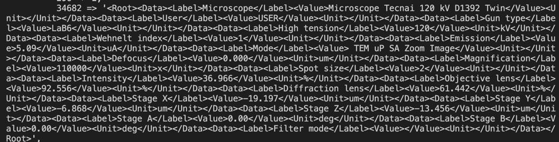

In this tutorial we will talk about regions of interest, how to extract them and how to analyse them on an actual example.

As a reminder, to get ROIs, first you need to find ROI map. To do so, you can either use `threshold` method:

```ts
const mask = image.threshold();
const roiMap = fromMask(mask);
```

or, if an image has more complex background and many small elements positioned closely to each other, use `watershed` function:

```ts
const roiMap = watershed(image, { points, mask });
```

| Good image for using threshold      | Good image for using watershed      |
| ----------------------------------- | ----------------------------------- |
|  |  |

:::caution
Before taking on the analysis of regions of interest we recommend to take a look at the tutorials for `watershed` and `threshold`.
:::

For the sake of simplicity we will use the same example as with a threshold method. However, we will put a little twist and use an image of [TIFF](https://en.wikipedia.org/wiki/TIFF 'wikipedia link on .tiff format') format. This format is great for storing and editing an image. It also allows adding metadata with extensive information about an image which we will examine a bit further in this tutorial. But for now let's not go too far ahead and take one step at a time.
To get regions of interest you need to extract them from a map:

```ts
//in this case we are interested in dark regions of interest, so we
//specify the kind of ROIs we want to extract.
const rois = roiMap.getRois({ kind: 'black' });
```

:::tip
For `getRois()` method you can use options `minSurface` and `maxSurface` to filter the ROIs by surface size.
So in this case we can specify the minimum surface of the regions in question:

```ts
const rois = roiMap.getRois({ kind: 'black', minSurface: 64 });
```

:::

Now we have all the regions identified and stored. We can work on the analysis of those regions.


To do so we need to understand what kind of analysis is necessary. Depending on the answer different tools can be used. Let's say we want to find the filter regions by size and shape. Now,
For the size it is rather straight-forward. You can use the `getRois()` options, as was mentioned above, or you can use region's perimeter and surface properties to filter the ROIs.
In this example let's get the regions which are above an average size of the `rois` sample.
First we need to find this average. It can be done in a rather straight-forward fashion:

```ts
let surfaceSum = 0;
for (const roi of rois) {
  surfaceSum += roi.surface;
}
const avgSurface = surfaceSum / rois.length;
```

After that we can get regions that are above the average size:

```ts
const biggestRois = [];
for (const roi of rois) {
  if (roi.surface >= avgSurface) {
    biggestRois.push(roi);
  }
}
```


The selected regions can be investigated further. For instance, we can use property like `roundness` to see how close the region's shape is to a circle. Let's put arbitrarily 0.9 as a limit.

```ts
let roundestRois = [];
for (const roi of biggestRois) {
  if (roi.roundness > 0.9) {
    roundestRois.push(roi);
  }
}
```


This provides us with a code like this:

```ts
const rois = roiMap.getRois({ kind: 'black' }); // In this example we specifically calculate the average surface of rois,
//so we don't use minSurface option here.

let surfaceSum = 0;
for (const roi of rois) {
  surfaceSum += roi.surface;
}
const avgSurface = surfaceSum / rois.length;

//We can calculate biggest and roundest rois in one cycle,
//but we split the logic between the two for the sake of this
//example.
const biggestRois = [];
for (const roi of rois) {
  if (roi.surface >= avgSurface) {
    biggestRois.push(roi);
  }
}

let roundestRois = [];
for (const roi of biggestRois) {
  if (roi.roundness > 0.9) {
    roundestRois.push(roi);
  }
}
```

## Getting metadata from TIFF files

Another aspect worth inspecting is extracting image metadata. If an image is of TIFF format, you can extract some metadata tags that can provide additional information about an image. For instance, you can get data such as image length and width or learn about image quality through bit depth(`bitsPerSample`) or X and Y Resolutions.
The metadata of TIFF format is split into two parts: `tiff` and `exif` which is another image format. We will focus on `tiff` part.

```ts
const meta = image.meta.tiff;
```

There you will have other two parts: one part will be comprised of a map with fields and then an object of TIFF meta tags which these fields' values are attributed to.


### Getting extra data

Within metadata, you might be wondering what is this huge mix of letters and numbers:



These are custom fields added with additional information about an image that the user. For instance, in this case you can get information about the microscope that was used, or the magnification level or the electrometric tension that was used while the image was taken. However, this data needs to be parsed, because it difficult to decipher it in its raw format.
To do so you need to split the lines first:

```

```


### Getting pixel size
