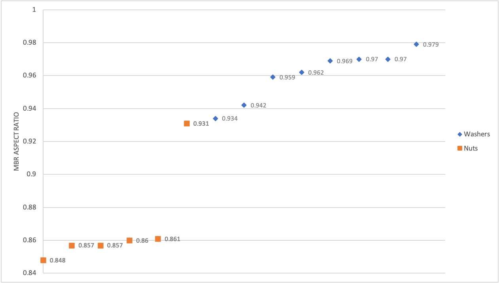

:::note
Before taking on the analysis of regions of interest we recommend to take a look at the tutorials for `watershed` and `threshold`, notably their options and the blurring techniques to optimize the output.
:::

ROI (Regions of Interest) analysis refers to the process of identifying and analyzing specific regions within an image that are of interest. It is probably a topic too vast to fit it completely in one tutorial. But we will try to give you the basic idea of what image analysis might look like.
First, let's take an image of particles made by electronic microscope as our example.


## Getting Regions of Interest

To get ROIs, first you need to find ROI map. There are two general ways of doing it. First one is `threshold` method which works well for images where elements are placed separately from each other:

```ts
const mask = image.threshold();
const roiMap = fromMask(mask);
```

Second option is `watershed` function. If an image has many adjacent elements, using `watershed` might be a better option:

```ts
const roiMap = watershed(image, { points, mask });
```

You can see a good image to use threshold on the left and an image for watershed on the right.


First we need to extract regions of interest from a map for further analysis:

```ts
//in this case we are interested in dark regions of interest, so we
//specify the kind of ROIs we want to extract.
let rois = roiMap.getRois({ kind: 'black' });
//Removes regions that did not fit in the image.
//It gives you a better data sample.
rois = clearBorder(mask, { color: 'black' });
```


Notice how the elements at the borders are not included. The reason is that these regions simply did not fit completely into our image ,so, their features, such as size or shape will not be represented correctly. So, we used `clearBorder` function to remove those elements. It is a good practice for regions' analysis.

## Getting distribution by size

Now we have all the regions identified and stored. We can work on the analysis of those regions.

In this case we will take our regions and calculate their distribution by size. Size distribution analysis is a method used to characterize and quantify the range of sizes present within a sample of particles or objects. It can be an important piece of data be it for simple size measurement or particle characterization and biological analysis.

First we need to find the limits of our sample.

```ts
const maxSurface = Math.max(...rois.map((roi) => roi.surface));
const minSurface = Math.min(...rois.map((roi) => roi.surface));
```

After that we can calculate the span of our sample:

```ts
const span = maxSurface - minSurface;
```

Then we will have the width of intervals (classes). There is no particular rule of how to choose it and you are free to choose your own class sizes, but the rule of thumb would be to use this formula:

```ts
//We round up the interval for simplicity.
const interval = Math.round(span / Math.sqrt(rois.length));
```

After that we can find how many ROIs belong to each interval.

```ts
const bySizeDistribution = new Map();

for (let i = minSurface; i < maxSurface; i += interval) {
  const count = rois.filter((roi) => {
    return roi.surface >= i && roi.surface < i + interval;
  }).length;
  //Deducted 1 from upper value so that the intervals
  //will not look overlapped.
  const intervalString = i + '-' + (i + interval - 1);
  bySizeDistribution.set(intervalString, {
    frequency: count,
    percentage: ((count / rois.length) * 100).toFixed(2),
  });
}
```

Now you have a data about size distribution in our sample:


| Interval (points) | Frequency | Percentage (%) |
| ----------------- | --------- | -------------- |
| 2-297             | 2         | 1.54           |
| 298-593           | 1         | 0.77           |
| 594-889           | 11        | 8.46           |
| 890-1185          | 10        | 7.69           |
| 1186-1481         | 22        | 16.92          |
| 1482-1777         | 19        | 14.62          |
| 1778-2073         | 26        | 20.00          |
| 2074-2369         | 13        | 10.00          |
| 2370-2665         | 17        | 13.08          |
| 2666-2961         | 7         | 5.38           |
| 2962-3257         | 1         | 0.77           |
| 3258-3553         | 1         | 0.77           |

With this we can receive data such as predominant particle size or size range, which can already give insights about properties of a sample. However, in ImageJS we are not limited to analyze samples by size, there exist more advanced techniques that we will discuss further.

## Analyzing regions with other properties and features

Analysis tools can also be used to distinguish different regions by their properties.
For the tutorial's sake let's take a more trivial example. Here we have a bunch of fasteners. Let's take a look at how we can identify washers and nuts as well as distinguish them from each other.


What sets nuts and washers apart from other elements is the fact that they have holes in them. In this case we can use `fillRatio` property which gives a ratio of ROIs surfaces with and without holes. We will also be applying `holesInfo()` method to see the information about how many holes a region possesses.
Finally we will also take their form factor into account and use `roundness` property. Roundness quantifies the deviation of an object's shape from a perfect circle. So, if the roundness of the perfect circle is 1, we will use 0.55 as a measure for our regions.

It is reasonable to assume that you don't know exactly what is the exact roundness coefficient or fill ratio of a washer, so you will eyeball it to see if your guess is close enough or not.
To visualize it better you can use `paintMask()` method to paint a mask of a region of interest on the image.

```ts
let mask = sourceImage
  .gaussianBlur({ sigma: 0.25 })
  .grey()
  //renyiEntropy looks like a better choice of algorithm
  //here. Check multiple algorithms to see which one
  //fits your needs best.
  .threshold({ algorithm: 'renyiEntropy' });
mask = clearBorder(mask, { color: 'black' });
const roiMap = fromMask(mask);
const rois = roiMap.getRois({ kind: 'black' });
//Making a copy to not overwrite the existing image.
let image = sourceImage;
const washersAndNuts = [];
for (const roi of rois) {
  if (
    roi.holesInfo().number >= 1 &&
    roi.roundness > 0.55 &&
    roi.fillRatio() < 0.9
  ) {
    //paintMask allows painting regions of interest on our
    //image. We recommend using it for highlighting regions
    //and for visual aid.
    image = image.paintMask(roi.getMask(), {
      origin: { column: roi.origin.column, row: roi.origin.row },
      color: [0, 0, 255, 255],
    });
  }
}
```

With this we will have our nuts and washers **ready for analysis**.


Like in previous example, we consider some regions not suited for analysis. One of the reasons here is that if objects are stuck to each other, the algorithm considers them as one region. Obviously, it is a problem because two washers put together have completely different properties than a single washer.The data becomes erroneous. A washer below is not treated as well for the reasons mentioned in the previous example.


Now we need to distinguish washers from nuts. To do so, we will use the aspect ratio of [minimum bounding rectangle](../Features/Regions%20of%20interest/MBR.md 'internal link on mbr') (MBR). The MBR is the smallest rectangle that can fit our region. Its aspect ratio will help us deduce whether it is a hexagon or a circle.
So, we will add some additional conditions to sort our regions. Methodically looking for the limit aspect ratio, we deduced that the threshold between a nut and a washer is approximately 0.932. It is not the most straight-forward value to find, and we found it empirically by looking at MBR aspects of all ROIs and deducing the threshold between two kinds of fasteners. So the only thing left is to sort them into different arrays:

```ts
const washers = [];
const nuts = [];
for (const roi of washersAndNuts) {
  //to see each aspect ratio you can
  //use console.log(roi.mbr.aspectRatio);
  if (roi.mbr.aspectRatio > 0.932) {
    nuts.push(roi);
    image = image.paintMask(roi.getMask(), {
      origin: {
        column: roi.origin.column,
        row: roi.origin.row,
      },
      color: [0, 255, 0, 255],
    });
  } else {
    washers.push(roi);
    image = image.paintMask(roi.getMask(), {
      origin: {
        column: roi.origin.column,
        row: roi.origin.row,
      },
      color: [255, 0, 0, 255],
    });
  }
}
```

With this we will get the desired result. All nuts and washers are found and sorted for analysis.


To get to this point we have a code like this:

```ts
let mask = sourceImage
  .blur({ width: 3, height: 3 })
  .grey()
  .threshold({ algorithm: 'renyiEntropy' });
mask = clearBorder(mask, { allowCorners: false, color: 'black' });
const roiMap = fromMask(mask);
const rois = roiMap.getRois({ kind: 'black' });
let image = sourceImage;
const washersAndNuts = [];
//Part where elements get picked apart from
//bolts and screws.
for (const roi of rois) {
  if (
    roi.holesInfo.number >= 1 &&
    roi.roundness > 0.55 &&
    roi.fillRatio() < 0.9
  ) {
    console.log(roi.id, roi.roundness, roi.mbr.aspectRatio);
    image = image.paintMask(roi.getMask(), {
      origin: { column: roi.origin.column, row: roi.origin.row },
      color: [255, 0, 0, 255],
    });
    washersAndNuts.push(roi);
  }
}
//Part where elements are distinguished.
const washers = [];
const nuts = [];
for (const roi of washersAndNuts) {
  if (roi.mbr.aspectRatio > 0.932) {
    nuts.push(roi);
    image = image.paintMask(roi.getMask(), {
      origin: {
        column: roi.origin.column,
        row: roi.origin.row,
      },
      color: [0, 255, 0, 255],
    });
  } else {
    washers.push(roi);
    image = image.paintMask(roi.getMask(), {
      origin: {
        column: roi.origin.column,
        row: roi.origin.row,
      },
      color: [255, 0, 0, 255],
    });
  }
}
```

And the elements sorted by MBR aspect ratio will be in this order:



These are some of the basic elements of ROI analysis.
However, this is just a fraction of tools that ImageJS possesses. There are other properties that you can discover more about in our [API features](../Features/Regions%20of%20interest/Regions%20of%20interest.md) section.
