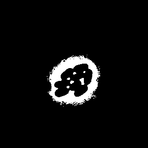
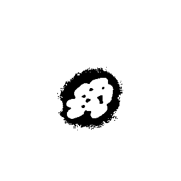

### Why is watershed necessary?

Threshold is a great tool for finding objects, but it works only if objects are clearly separated from each other.

Sometimes objects can be stuck to each other and the binary image takes it as a giant region of interest, which is not the desired result.

Let's take a look at this image. The cells here are quite close to each other and if we call a threshold function and compare two images it will be something like this.

| Input image                                  | What threshold mask looks like                     | What threshold mask looks like(inverted)              |
| -------------------------------------------- | -------------------------------------------------- | ----------------------------------------------------- |
|  |  |  |

That's what the watershed algorithm is for.

The idea behind watershed is that it finds extreme points of intensity and from these points it finds all ROIs.
For instance, with watershed, regions from the above image will look like this:

| Input image                                  | What watershed found(in color)                             |
| -------------------------------------------- | ---------------------------------------------------------- |
|  |  |

Nice and clean, right?

But if you try to use watershed like that:

```ts
const roiMap = waterShed(image);
```

You will receive something like this:


This is not an input image that was mistakenly added as an example. This is an output image after default watershed. Why did nothing happen? Because the algorithm simply will not give the result without more specifics. the way watershed can be applied differs from one image to the other. There is no "one-size-fits-all" configuration. It means you can customize the output as you would like, but it also means that without parameters you will not achieve the desired results.

Let's have a look at the factors that account for a correct image output.

### Blurring

First thing that you need to do is to remove image noise. While looking for regions of interests we mostly look for changes of intensity, therefore removing small noise "dots" improve results. It is recommended to apply it to any image when it comes to ROI analysis.

ImageJS has several kinds of blurring:

- [blur filter](../Features/Filters/Blur.md)

- [gaussian blur filter](../Features/Filters/Gaussian%20Blur.md)

- [median filter](../Features/Filters/Median.md)

Each filter serves its own purpose, which we will briefly explain.

#### Blur

It is a basic tool that uses a simple mean in the kernel to compute the intensity of a pixel.

#### Gaussian blur

As the name suggests it is a kind of blurring technique. However, unlike regular blur, Gaussian blur uses **wighted** average. This means, that the intensity value is also taken into account during computation.

#### Median

Honestly speaking, with proper tuning, any filter will do here. But keep in mind that depending on the image, result from these three filters can vary.

**Check median vs blur vs gaussianBlur images**

### Thresholding and getting a mask

We recommend doing it after blurring. Getting a mask by threshold algorithm will not give you all the regions of interest, but it will provide general locations of where they reside. After all, like watershed, threshold is using differences in pixel intensities to get these regions.


### Finding extrema

[Finding extrema](https://en.wikipedia.org/wiki/Maximum_and_minimum 'wikipedia link on extrema') is one of the most crucial aspects for watershed because these are the starting points for each region of interest. However, unfiltered, there can be tens or even hundreds of those on the image, as you can see. So how to spot the correct ones?

There are two functions that are responsible for finding extrema: `getExtrema` and `removeClosePoints`.

#### getExtrema

This function searches for all local extrema(minima in case of this image). It checks each point for the values around. If all the neighbors are smaller, the point in-check becomes the minima(for maxima it checks if all values are bigger).
In the end it returns all extreme points of the image:

```ts
const points = getExtrema(
  image,
  { kind: 'minimum', algorithm: 'square' },
  mask,
);
```

:::note
Adding mask improves the precision of the algorithm, so it is highly recommended to add it as a parameter.

**add images with and without mask**
:::

In `getExtrema` function there are three algorithm shapes that represent the searching area:

|                                Algorithm                                 |                           What it is                            |
| :----------------------------------------------------------------------: | :-------------------------------------------------------------: |
|     |    Checks extremum in 4 directions: up,down,left and right.     |
|  |        Looks for extremum within all neighboring points.        |
|        | Looks for extremum beyond the neighbors within main directions. |

The chosen algorithm changes the size of the area that it checks.

#### removeClosePoints

But even with this `getExtrema` can only give us a smaller number of local extrema. Moreover, if overdone, it can neglect certain extrema that would be considered correct.

**add images for different algorithms**

This is where another function can be used: `removeClosePoints`. With `distance` option this function can weed out local minima If there are too many extreme points in one spot, `removeClosePoints` removes the indicated number of points. With some tampering of those two options you should get the correct number of minima.
For instance, in the case of this image, extrema can be obtained with this:

```ts
const points = getExtrema(
  image,
  { kind: 'minimum', algorithm: 'square' },
  mask,
);
const filteredPoints = removeClosePoints(points, image, { distance: 17 });
```

**add images to show get extrema**

### Conclusion

So, to conclude, first you must blur the image. The choice of a blurring technique depends on what kind of image is to blur, but regular blur will do.

After that, a threshold needs to be defined. It can be defined as an arbitrary value, but we recommend to compute a threshold mask from the image of interest.
Result can vary from one threshold algorithm to another so take a look at a few of them to see which one fits your needs.

Then extrema need to be found and filtered based on their intensity and position. You should get one point per region.

:::caution
Don't forget! If you look for brightest regions then you need to specify `kind` option as `maximum`, if darkest - `minimum`.
:::

With that, you are ready to use watershed. Here's the code:

```ts
let blurredImage = image.blur({ width: 3, height: 3 }).grey();
const mask = image.threshold({ algorithm: 'intermodes' });
const points = getExtrema(image, {
  kind: 'minimum',
  algorithm: 'square',
  mask,
});
const filteredPoints = removeClosePoints(points, image, {
  distance: 17,
  kind: 'minimum',
});
const roiMap = watershed(image, { points: filteredPoints, mask });
```

This will give the map of all the regions of interest. To learn how to
