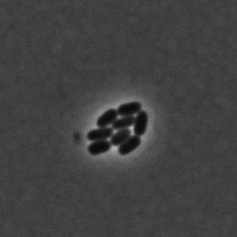
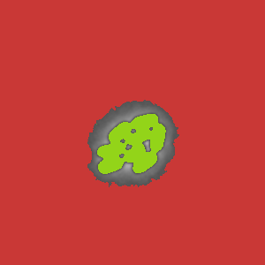
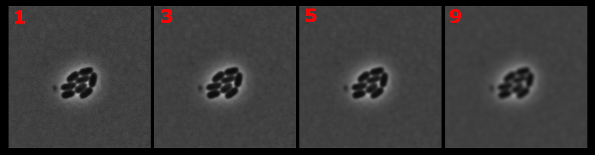

In this tutorial we will talk about watershed algorithm, why it is used and the basics of how it is implemented. We will also cover some errors that you might encounter during its use.

## Why is watershed necessary?

[Threshold](../Features/Operations/Threshold.md 'internal link on threshold') is a great tool for finding objects, but it works only if objects are clearly separated from each other.

Sometimes objects can be stuck to each other and the binary image takes it as a giant region of interest, which is not the desired result.

Let's take a look at this image. The cells here are quite close to each other and if we call a threshold function and color output regions it will be something like this:

| Input image                                  | What threshold mask looks like              |
| -------------------------------------------- | ------------------------------------------- |
|  |  |

Two massive regions while, in reality, there are several cells there.
That's what the watershed algorithm is for.

The idea behind watershed is that it finds extreme points of intensity and from these points it finds all ROIs.
For instance, with watershed, here are the regions that are found:

| Input image                                  | What watershed found(in color)                             |
| -------------------------------------------- | ---------------------------------------------------------- |
|  |  |

Nice and clean, right?

But if you try to use watershed like that:

```ts
const roiMap = waterShed(image);
```

Most likely you won't be able to extract any regions of interest and put them on the image. Most likely, you will get the same image output as the input.


Why did nothing happen? Because the algorithm simply will not give the result without more specifics and the way watershed can be applied differs from one image to the other. There is no "one-size-fits-all" configuration. It means you need to customize the output depending on the input image, but it also means that without parameters you will not achieve the desired results.

Let's have a look at the factors that account for a correct regions output.

## Grayscaling and Blurring

First thing is to check the [color model](../Glossary.md#color-model 'internal link on glossary') of an image. If the image is colored, you need to apply grayscale filter, otherwise the watershed algorithm will not work. To do so type:

```ts
let image = sourceImage.grey();
```

You can take a look at different types of grayscale algorithm on [grayscale page](../Features/Filters/Grayscale.md 'internal link on grayscale') in our "Features" section, but a default grayscale should be enough, since the important aspect is for an image to have only one channel.

Next thing that you possibly need to do is to remove [image noise](https://en.wikipedia.org/wiki/Image_noise 'wikipedia link on image noise'). It is especially recommended if the image is of poor quality.

ImageJS has several kinds of blurring:

- [blur filter](../Features/Filters/Blur.md)

- [gaussian blur filter](../Features/Filters/Gaussian%20Blur.md)

- [median filter](../Features/Filters/Median.md)

Each filter serves its own purpose, which we will briefly explain.

#### Blur

It is a basic tool that uses a simple average of the neighboring points and replaces point's value with the average. While mean blur is straightforward and computationally efficient, it may not be the best choice in situations where preserving fine details and edges is crucial.
To use it you need to specify width and height of the kernel:

```ts
let image = image.blur({ width: 3, height: 3 });
```

#### Gaussian blur

As the name suggests it is a kind of blurring technique. However, unlike regular blur, Gaussian blur uses **weighted** average. This means, that the intensity value is also taken into account during computation. It works better than regular blur but it can be slower to work through.It is effective against high-frequency noise.
To use you need to specify the size of kernel. This is one of the ways of doing it.

```ts
let image = image.gaussianBlur({ sigma: 3 });
```

To discover more options you can visit our "Features" page about [gaussian blur](../Features/Filters/Gaussian%20Blur.md 'internal link on gaussian blur').

#### Median

Median filter sorts all the neighbor values in ascending order and sets the pixel to the median value of this array. Unlike blur, median filter is better at preserving image edges and dealing with salt-and-pepper noise, but it works worse at the edges of the image.
To use median filter you need to specify the kernel size and the algorithm to treat borders. How the border algorithm works is not really a goal of this tutorial. Just know that this option is mandatory.

```ts
let image = image.medianFilter({ cellSize: 3, borderType: 'reflect101' });
```

:::caution
For each technique, kernel size must be an odd number in order for algorithm to find the center correctly!
:::

Honestly speaking, any filter will do here. But keep in mind that depending on the image, result from these three filters can vary. And do not overdo it. Giving a kernel too big and the image details will deteriorate too much.
Here you can see blurring with different kernel size(red numbers). By kernel of size 9 it becomes difficult to see the regions' boundaries.



Any further blurring will deteriorate image details completely.

## Thresholding and getting a mask

We recommend doing it after blurring. Getting a mask by threshold algorithm will not give you all the regions of interest, but it will provide general locations of where they reside. After all, like watershed, threshold is finding a value that is using differences in pixel intensities to get these regions.

Here you can see how thresholding works with different algorithms.


As you can see, different algorithms provide different results. Here we want to analyze the cells in the middle, so a good choice of algorithm would be `isodata` or `intermodes`.

```ts
const mask = image.threshold({ algorithm: 'isodata' });
```

## Finding extrema

[Finding extrema](https://en.wikipedia.org/wiki/Maximum_and_minimum 'wikipedia link on extrema') is one of the most crucial aspects for watershed because these are the starting points for each region of interest. However, unfiltered, there can be tens or even hundreds of those on the image, as you can see.


So how to spot the correct ones?

There are two functions that are responsible for finding extrema: `getExtrema` and `removeClosePoints`.

#### `getExtrema`

This function searches for all local extrema(minima in case of this image). It checks each point for the values around. If all the neighbors are smaller, the point in-check becomes the minima(for maxima it checks if all values are bigger).
In the end it returns all extreme points of the image:

```ts
const points = getExtrema(
  image,
  { kind: 'minimum', algorithm: 'square' },
  mask,
);
```

:::note
Adding mask improves the precision of the algorithm, so it is highly recommended to add it as a parameter (Here ROIs are colored for visual aid).

|              Watershed ROIs from extrema without mask               |             Watershed ROIs from extrema with mask             |
| :-----------------------------------------------------------------: | :-----------------------------------------------------------: |
|  |  |

You can notice small particles that the `getExtrema` picks on. It is not very crucial for visual representation of regions. However, if there is a need for more complex analysis, all those spots will be considered regions of interest and you will need to make extra steps to remove them. Adding mask as `getExtrema` option will simply facilitate your further

:::

In `getExtrema` function there are three algorithm shapes that represent the searching area(checked points are colored in light red):

|                                Algorithm                                 |                          What it is                          |
| :----------------------------------------------------------------------: | :----------------------------------------------------------: |
|     |   Checks extremum in 4 directions: up,down,left and right.   |
|  |        Checks extremum within all neighboring points.        |
|        | Checks extremum beyond the neighbors within main directions. |

The chosen algorithm changes the size of the area that it checks.

#### `removeClosePoints`

But even with this `getExtrema` can only give us a smaller number of local extrema. Moreover, if overdone, it can neglect certain extrema that would be considered correct.


This is where another function can be used: `removeClosePoints`. With `distance` option this function can weed out local minima If there are too many extreme points in one spot, `removeClosePoints` removes the indicated number of points. With some tampering of those two options you should get the correct number of minima.
For instance, in the case of this image, extrema can be obtained with this:

```ts
//Don't forget to explicitly specify the kind of points you are looking for
const points = getExtrema(
  image,
  { kind: 'minimum', algorithm: 'square' },
  mask,
);
const filteredPoints = removeClosePoints(points, image, { distance: 17 });
```

This is how extrema will now be situated:


## Applying watershed

Finally, with all the preparations you can actually use watershed function. At this point we covered every important aspect for watershed to work, so all is left is assemble extrema and mask like this:

```ts
const roiMap = watershed(image, { points: filteredPoints, mask });
```

It is worth mentioning, however, that mask is not the only way of finding ROIs. Another way of applying watershed is to pass the threshold value directly. While looking for threshold we looked for a mask, but we can also find the threshold value that the mask is based on.  
Thus, by using `computeThreshold()` function we can pass its result like this:

```ts
//mask was using `isodata` algorithm, so we use the same algorithm here
const thresholdValue = computeThreshold(image, 'isodata');
const roiMap = watershed(image, {
  points: filteredPoints,
  threshold: thresholdValue,
});
```

It will provide the same result as if a threshold mask was used.

## Conclusion

So, to summarize, first you must blur the image. The choice of a blurring technique depends on what kind of image is to blur, but regular blur will do. The kernel size can be 3 or 5. If it gets too big, objects' edges and minor details start to deteriorate.

After that, a threshold needs to be defined. It can be defined as an arbitrary value, but we recommend to compute a threshold mask from the image of interest.
Result can vary from one threshold algorithm to another so take a look at a few of them to see which one fits your needs.

Then extrema need to be found and filtered based on their intensity and position. You should get one point per region.

:::caution
Don't forget! If you look for brightest regions then you need to specify `kind` option as `maximum`, if darkest - `minimum`.
:::

With that, you are ready to use watershed. Your code should resemble something like this:

```ts
let blurredImage = image.blur({ width: 3, height: 3 }).grey();
const mask = image.threshold({ algorithm: 'intermodes' });
const points = getExtrema(image, {
  kind: 'minimum',
  algorithm: 'square',
  mask,
});
const filteredPoints = removeClosePoints(points, image, {
  distance: 17,
  kind: 'minimum',
});
const roiMap = watershed(image, { points: filteredPoints, mask });
```

This will provide a map of all regions of interest(ROIs are colored here):


