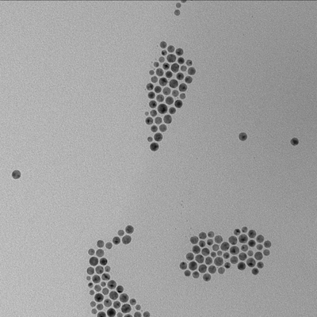
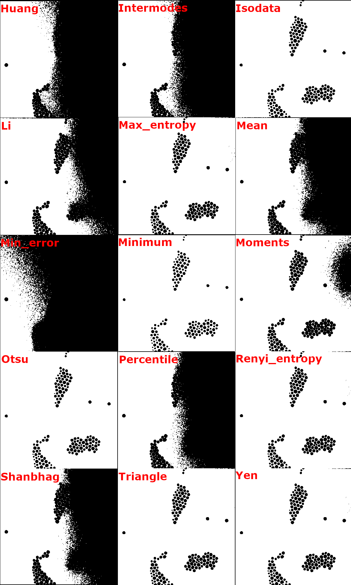

In this tutorial we are going to cover the threshold operation and how to get a map of regions from the threshold's mask.

### What is threshold and where it is used

Thresholding is a simple technique used for image segmentation. It compares the pixel intensity to a certain precalculated value(threshold) and ,based on that, provides a mask.
The reason why it is an important algorithm is because getting the mask is one of the ways to get regions of interest for analysis. It is especially useful when objects are clearly defined by intensity difference. For instance here is the image of particles.



Each object is well-defined and separated from each other, so in this case threshold algorithm will fit perfectly.

### Choosing an algorithm

There are two ways of using threshold: by calling an algorithm name or by directly using a threshold value. The value can be arbitrary, or it can be precalculated based on one of the algorithms.

:::tip
If you want to use threshold by a threshold value of one of the algorithms, you can use `computeThreshold` function:

```ts
const value = computeThreshold(image, 'otsu');
// computeThreshold computes the intensity value, but threshold function accepts it
//as a ratio between 0 and 1. So a division on maximum value is necessary.
const mask = image.threshold({ threshold: value / image.maxValue });
```

:::

Threshold possesses different possible algorithms which can produce different results.



By using threshold method you convert an image into a `Mask` class object:

```ts
// Algorithm is otsu by default but
// we added the parameter here to show how the it is used.
const mask = image.threshold({ algorithm: 'otsu' });
```

### Finding ROI map

After the mask has been created, all is left is to create a `RoiMap` object. `RoiMap` is an object that stores the data about the number and the kind of regions of interest situated on an image/mask.
To get this map all you need is to apply `fromMask()` function:

```ts
import fromMask from 'image-js';

const roiMap = fromMask(mask);
```
