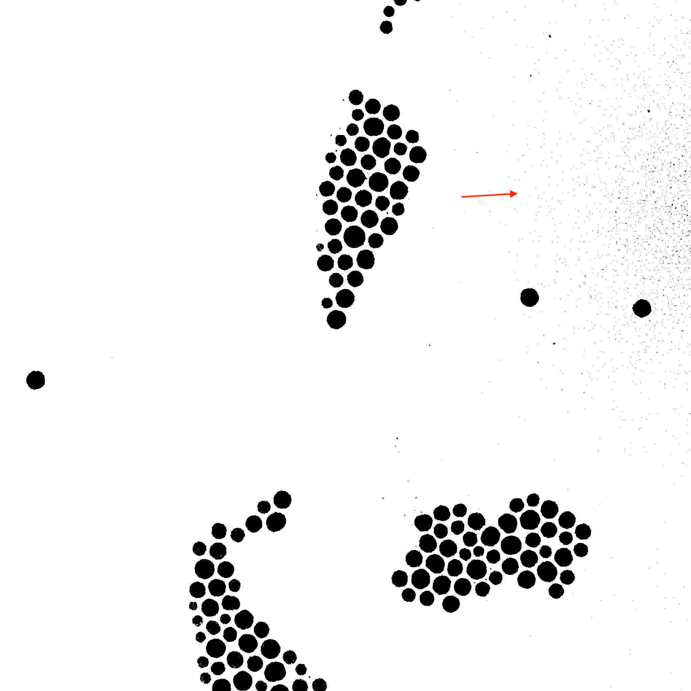

If you looked at some of our tutorials, you might have noticed that we apply a blurring technique before applying an actual filter like threshold or watershed. We do that in order to improve the image input by reducing the image noise and small elements that could disrupt image analysis. This tutorial will clarify which technique is used in which scenario.

## Blur

Blur or box blur is a filter that uses convolution matrix to calculate an average among the surrounding pixels which are within the transformation matrix (kernel) and then applies this value.

in case of mean blur the kernel (for width and height being equal to 3 at least) will look like this:

$$
\begin{bmatrix}
1 & 1 & 1 \\
1 & 1 & 1 \\
1 & 1 & 1
\end{bmatrix}
$$

The key advantage of box blur compared to other filters is its speed. It doesn't need to calculate gaussian matrix, based on its sigma (variance), like Gaussian Blur, nor does it need to sort all values within the cells, like median.
However, this also means that every pixel has the same weight to the algorithm regardless of its position. This means that it's speed comes at the cost of the output quality.

## Gaussian Blur

Gaussian blur applies gaussian distribution formula to create a matrix which weighted average for convolution which means that it takes into account the position of the pixel as well. So, if box blur's convolution matrix would look like this:

$$
\begin{bmatrix}
1 & 1 & 1 \\
1 & 1 & 1 \\
1 & 1 & 1
\end{bmatrix}
$$

Gaussian blur's matrix might look like this:

$$
\begin{bmatrix}
1 & 2 & 1 \\
2 & 4 & 2 \\
1 & 2 & 1
\end{bmatrix}
$$

The values of the table will probably be floating numbers rather than integers but the idea is this: the closer you are to the pixel in check, the more weight it will have during average computation.

Gaussian blur is good for edge detection. Edge detection's algorithms are sensitive to noise and small details and this filter smoothens them. For instance here is the example of a [Canny Edge detector](../Features/Morphology/Canny%20Edge%20Detector.md 'internal link on canny edge detector') with and without gaussian blur:

## Median Filter

Median filter is used differently from blurs. The obvious difference is the fact that median filter looks for a median value in the area, rather than the average like blur does. This means that the values in the surface in check need to be sorted first, which slows the algorithm down. Median filer also needs to treat image borders differently because there are not enough entries to fill the window. But even then, among the three filters, median is the best at preserving objects' edges and details.
It is particularly effective against ["salt-and-pepper"](https://en.wikipedia.org/wiki/Salt-and-pepper_noise 'wikipedia link on salt and pepper') effect.

## What algorithm to use?

Even though it might look clear when to use one algorithm or the other in theory, on practice the end result might not be that obvious.
Take a look at these images.

You could make an argument that after taking a closer look the gaussian blur has a more "natural" blurring than a regular blur. Or that images after median filter have slightly better detailing. But these differences would not be substantial for an average user.
When it comes to image analysis, however, things are different. Let take a look at the image used in our tutorials.

Here is the image of particles of high quality. The problem with high quality is that it improves overall quality of the image details, which makes threshold to pick on noise which is undesirable during image analysis. These small dots become regions, they start disrupting data collection the whole analysis goes sideways etc.

To improve it, applying blur is necessary. But we don't really have preserving edges as the priority, we want to remove useless dots from our mask. So applying gaussian blur is a reasonable choice.

It was mentioned in the tutorials, but you can get a good result with all three techniques. The question is, however, which of these three to use in what situation.

Therefore the idea is this: if an image is of good quality and you want to focus on well-defined objects, use blur or gaussian blur (if speed is not a pressing issue gaussian blur is preferable). If an image is of decent quality and you want . If you need to preserve edges of the elements or if an image has noise, especially "salt-and-pepper" one, use median filter.
