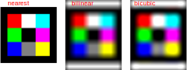

# `transform()` and its parameters

We have discussed how `transform()` can be applied
`transform()` represents a fundamental operation of image processing, so it would be nice to
talk a bit more in depth about its parameters and what other capabilities this function has.

### Parameters:

- image to transform
- matrix
- options

### Options

#### Width and Height

`width` and `height` just represent dimensions of the destination image.

#### Interpolation Type

Now, let's talk about `interpolationType`.

:::warning
You might be thinking that `bicubic` will be always the way to go, since it should transfer the most details from the source. However, that's not always the case.
Let's take a look at this simple 10x10 image (image was enlarged here for display purposes):


And now let's enlarge the image by a factor of 10 using different interpolations:

```ts
const resizeMatrix = [
  [1, 0, 0],
  [0, 1, 0],
  [0, 0, 1],
];
const newImage = image.transform(resizeMatrix, {
  fullImage: true,
  interpolationType: 'nearest',
});
const newImage2 = image.transform(resizeMatrix, {
  fullImage: true,
  interpolationType: 'bilinear',
});
const newImage3 = image.transform(resizeMatrix, {
  fullImage: true,
  interpolationType: 'bicubic',
});
```

And see the results:



As you can see, sometimes, `nearest` can be a better choice for interpolation algorithm, because it handles abrupt color changes better.
:::

#### Border Type

To understand what `borderType` is, we need to get back to interpolation for a moment. When you transform an image (rotate, scale, skew, etc.), the new pixel positions often interpolate to coordinates in the original image that don't exist - for example, negative coordinates or coordinates beyond the image edges. The `borderType` tells the algorithm what value to use for these "out-of-bounds" pixels. There are several approaches to it:

- CONSTANT (`constant`): every value at the border will be equal to constant value.

- REFLECT (`reflect`): every value at the border will be reflected from the original image.

- REFLECT_101 (`reflect101`):

- REPLICATE (`replicate`)

- WRAP (`wrap`)

#### Border Value

`borderValue` is used if `borderType` is set as `constant`. We can choose what will be the value for borders.

#### Inverse

We have briefly showed how this option is used in our tutorial on image transformations. Let's take a deeper look at what this option represents.
As was mentioned in the tutorial transformation process is just us applying the transformation matrix on each pixel coordinate.

However, what if we wanted to revert transformation back, based on the image

#### Full Image

`fullImage` makes sure that all pixels of source image are transferred to a new one.
