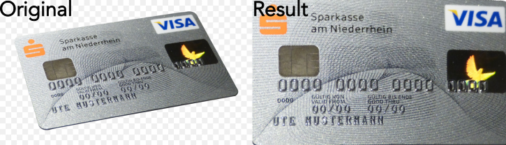

# Get perspective warp matrix

_Returns a perspective transformation matrix from source points that transforms a quadrilateral._

[Options and parameters of `getPerspectiveWarp` function](https://api.image-js.org/functions/index.getPerspectiveWarp.html)

`getPerspectiveWarp` function takes 4 corner points (source quadrilateral) and then calculates the 3×3 perspective transformation matrix that allows removing [perspective distortion](https://en.wikipedia.org/wiki/Perspective_distortion).
The function also returns width and height of the new image.
If they were put as option's parameters it just returns indicated width and height, otherwise it calculates new width and height from given source points.

### Basic use case

```ts
const image = readSync('path/to/file.png');
// Define source corners (original image points) and destination image width and height.
//  In this case they correspond to credit card's corner points.
const sourcePoints = [
  [
    { column: 55, row: 140 },
    { column: 680, row: 38 },
    { column: 840, row: 340 },
    { column: 145, row: 460 },
  ],
  { width: 725, height: 425 },
];

// Get transformation matrix using 4 points and `getPerspectiveWarp` function.
const projectionMatrix = getPerspectiveWarp(sourcePoints);
const projectedImage = image.transform(matrix.matrix, {
  width: matrix.width,
  height: matrix.height,
  inverse: true,
});
```



### Parameters and default values

- `pts`

- `options`

#### Options

| Property                                                                                    | Required | Default value |
| ------------------------------------------------------------------------------------------- | -------- | ------------- |
| [`width`](https://api.image-js.org/interfaces/index.GetPerspectiveWarpOptions.html#width)   | no       | -             |
| [`height`](https://api.image-js.org/interfaces/index.GetPerspectiveWarpOptions.html#height) | no       | -             |
