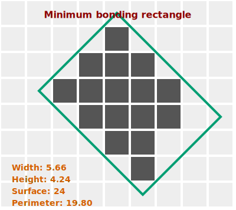

# MBR

_Smallest rectangle that fully encloses a region of interest, providing a bounding box with minimal area._

[🎭 Mask options and parameters of `getMbr` method](https://api.image-js.org/classes/index.Mask.html#getMbr)  
[🔎 ROI options and parameters of `mbr` accessor](https://api.image-js.org/classes/index.Roi.html#mbr)

Minimum Bounding Rectangle(MBR) is the smallest rectangle which can fit the region of interest in question.



MBR is relevant for such things as extracting features, detecting collisions or simply localizing objects.

In ImageJS minimum bounding rectangle is a ROI class accessor that returns a `Mbr` object.

| Property name                                                                   | Description                          | Property type |
| ------------------------------------------------------------------------------- | ------------------------------------ | ------------- |
| [`points`](https://api.image-js.org/interfaces/index.Mbr.html#points)           | points that form MBR                 | `Point[]`     |
| [`perimeter`](https://api.image-js.org/interfaces/index.Mbr.html#perimeter)     | MBR's perimeter                      | `number`      |
| [`surface`](https://api.image-js.org/interfaces/index.Mbr.html#surface)         | MBR's surface                        | `number`      |
| [`height`](https://api.image-js.org/interfaces/index.Mbr.html#height)           | MBR's height                         | `number`      |
| [`width`](https://api.image-js.org/interfaces/index.Mbr.html#width)             | MBR's width                          | `number`      |
| [`angle`](https://api.image-js.org/interfaces/index.Mbr.html#angle)             | MBR's angle                          | `number`      |
| [`aspectRatio`](https://api.image-js.org/interfaces/index.Mbr.html#aspectRatio) | ratio between MBR's width and height | `number`      |

```ts
const mbr = roi.mbr;
```

It can also be a Mask method to calculate its mbr:

```ts
const mbr = mask.getMbr();
```

<details>
<summary><b>Implementation</b></summary>

Here's how Minimum Bounding Rectangle is calculated in ImageJS:

_Finding convex hull_:an algorithm is based on the fact that one of the MBR sides is aligned with one of the convex hull sides.

_Rotating an object_: an object gets rotated parallel to the X-axis. It allows finding tilt angles of the diameters. It also facilitates calculation of the points. After all the data is found, it just gets rotated back by the same angle to get actual result.

_Finding extremities_: since the object is rotated, it means that vertical lines will be perpendicular to the hull side in question. Therefore, for each side, algorithm finds extremities which in turn calculate into points, width and surface.

</details>
