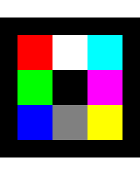

# `transform()` and its parameters

`transform()` represents a fundamental operation of image processing. It needs two parameters for it to work:

- image to transform
- transformation matrix

However, it also has an `options` parameter which enhances its capabilities.
In this article we will talk about what these options do and how they are useful.

### Options

#### Width and Height

`width` and `height` are pretty straight-forward as options: they represent dimensions of the destination image. If these values are not specified, they will be equal to source image's.

#### Interpolation Type

To understand `interpolationType`, imagine you're scaling an image up by 2. The new image has 4 times as many pixels, but where do the "in-between" pixel values come from? Interpolation algorithms calculate these new pixel values based on surrounding original pixels.
Available interpolation types:

`nearest` - Uses the value of the nearest pixel (fastest, preserves sharp edges).

`bilinear` - Linear interpolation between 4 nearest pixels (smooth gradients).

`bicubic` - Cubic interpolation using 16 nearest pixels (smoothest, best quality).

<details>
<summary>
<b>Which interpolation is best?</b>
</summary>

You might be thinking that `bicubic` will be always the way to go since it should transfer the most details from the source. However, that's not always the case.
Let's take a look at this simple 10x10 image (image was enlarged here for display purposes):



And now let's enlarge the image by a factor of 10 using different interpolations:

```ts
const resizeMatrix = [
  [10, 0, 0],
  [0, 10, 0],
  [0, 0, 1],
];
const newImage = image.transform(resizeMatrix, {
  fullImage: true,
  interpolationType: 'nearest',
});
const newImage2 = image.transform(resizeMatrix, {
  fullImage: true,
  interpolationType: 'bilinear',
});
const newImage3 = image.transform(resizeMatrix, {
  fullImage: true,
  interpolationType: 'bicubic',
});
```

And see the results:


As you can see, sometimes, `nearest` can be a better choice for interpolation algorithm, because it handles abrupt color changes better. This is just one of the examples that shows that "smoothest" does not always equal to "best".

</details>

:::note
You can check out [this video](https://www.youtube.com/watch?v=AqscP7rc8_M) that wonderfully explains how interpolation happens in more detail.
:::

#### Border Type

To understand what `borderType` is, we need to get back to interpolation for a moment. When you transform an image (rotate, scale, skew, etc.), the new pixel positions often map to coordinates in the original image that don't exist - for example, negative coordinates or coordinates beyond the image edges. The `borderType` tells the algorithm how to handle these "out-of-bounds" pixels. There are several approaches:

`constant` - Fill border areas with a constant color value (specified by [`borderValue`](./transform-function-and-its-parameters.md#border-value))

`reflect` - Mirror edge pixels: [1,2,3,4] → [2,1,1,2,3,4,4,3]

`reflect101` - Mirror edge pixels without repeating the edge: [1,2,3,4] → [3,2,1,2,3,4,3,2]

`replicate` - Extend edge pixels: [1,2,3,4] → [1,1,1,2,3,4,4,4]

`wrap` - Wrap around to opposite edge: [1,2,3,4] → [3,4,1,2,3,4,1,2]


#### Border Value

`borderValue` is used when `borderType` is set to `constant`. It specifies the pixel value to use for out-of-bounds pixels. The value should be a number that will be the same for all channels of the pixel in question, regardless of image's number of channels.

```ts
const result = image.transform(matrix, {
  borderType: 'constant',
  borderValue: 255, // White border
});
```

#### Inverse

We have briefly shown how this option is used in [our tutorial on image transformations](../tutorials/applying-transform-function-on-images.md). Let's take a deeper look at it.
The `inverse` controls how the transformation matrix is applied during the image transformation process. Understanding this concept is crucial for getting the expected results from your transformations.
When transforming an image, there are two fundamental approaches:

- **Forward mapping** (inverse: false): Apply the matrix to source coordinates to find destination coordinates.
- **Backward mapping** (inverse: true): Source image is treated as destination image. For each destination pixel, the inverse matrix applies to find which source pixel to sample from.

Let's take a simple example. Let's say we want to rotate an image by 45 degrees through transformation matrix:

```ts
//Rotation matrix
const centerX = image.width / 2;
const centerY = image.height / 2;
const cosA = Math.cos(Math.PI / 4);
const sinA = Math.sin(Math.PI / 4);

const rotationMatrix = [
  [cosA, -sinA, centerX - centerX * cosA + centerY * sinA],
  [sinA, cosA, centerY - centerX * sinA - centerY * cosA],
  [0, 0, 1],
];
const result = image.transform(rotationMatrix, {
  inverse: true, // Default
});

const result2 = image.transform(rotationMatrix, {
  inverse: false,
});
```

As you can see using the same matrix images the image seems to be turned into opposite directions. Basically, with `inverse` set to `true` you kind of "revert" an image back to the states that it was before the matrix transformed.


#### Full Image

`fullImage` ensures that the output image is large enough to contain all transformed pixels from the source image, preventing any cropping. When true, the function automatically calculates the required output dimensions.

```ts
//Without fullImage - may crop transformed pixels
const result1 = image.transform(rotationMatrix, {
  fullImage: false,
});

// With fullImage - automatically sizes output to fit all pixels
const result2 = image.transform(rotationMatrix, {
  fullImage: true, // Output dimensions calculated automatically
});
```

This is particularly useful for rotations, where corners of the image may extend beyond the original boundaries.


